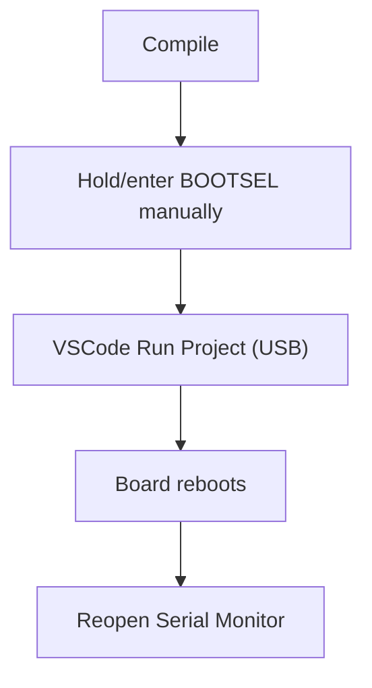
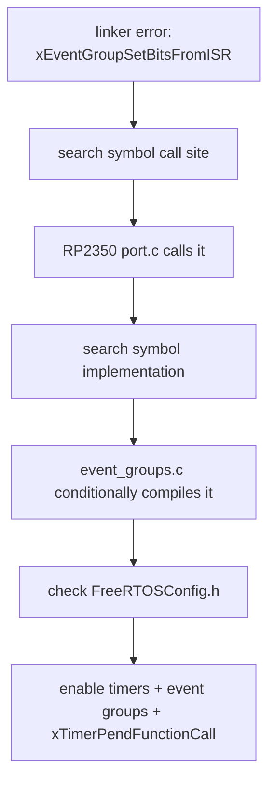

# 00. 项目搭建、板卡联调与 FreeRTOS 入门背景

日期范围：2026-05-25 至 2026-05-28

板卡：Waveshare RP2350-PiZero / RP2350B

环境：Windows + VSCode + Raspberry Pi Pico extension + Pico SDK 2.2.0 + Ninja

本文记录 01 号笔记之前的主线内容：为什么选择这个项目、工程如何建立、Pico SDK 配置如何取舍、USB 串口与烧录问题如何排查、FreeRTOS 如何接入，以及第一次多任务 demo 学到了什么。

## 1. 为什么选择这个方向

最初的问题是：不额外接外设，只靠开发板可以做什么嵌入式项目。

当时筛选出的适合方向包括：

| 方向 | 适合练习 |
| --- | --- |
| 串口命令行 Shell | 命令解析、系统控制、调试接口 |
| 板载状态机/虚拟传感器 | 裸机架构、时间管理、数据流 |
| FreeRTOS 多任务监控台 | 任务、优先级、队列、信号量、系统监控 |
| Flash 参数保存 | 非易失存储、配置管理 |
| 看门狗与故障恢复 | 可靠性设计 |
| Bootloader/串口升级 | 启动流程、固件校验、升级协议 |

最终选 FreeRTOS 的原因：

1. 不需要额外外设，只用 USB 串口就能观察系统行为。
2. 很适合从“裸机轮询 + 状态机”过渡到“任务 + 通信 + 调度”。
3. 后续可以自然扩展出串口 CLI、日志任务、系统状态查询、虚拟传感器、Flash 配置保存。

初始学习路线可以概括为：


## 2. 板卡与工程环境

实际使用的开发板是 Waveshare RP2350-PiZero，核心是 RP2350B。

工程目录：

```text
C:\MCU_Project\FreeRTOS_Training
```

开发约定：

| 项目 | 约定 |
| --- | --- |
| 工程生成 | 用 VSCode Pico SDK 插件生成，不手搓初始骨架 |
| 编译生成器 | Ninja |
| 编译执行 | 默认由用户手动编译；需要我编译时必须明确说明 |
| 烧录方式 | 优先手动 BOOTSEL + VSCode `Run Project (USB)` |
| 版本控制 | Git 本地仓库，分支 `main` |
| 文档 | 重要现象和结论放入 `docs` |

当前 Git 历史：

| commit | 内容 |
| --- | --- |
| `4c23fba` | Pico SDK USB serial baseline |
| `633e2ba` | Add FreeRTOS kernel submodule |
| `ee7235e` | Add minimal FreeRTOS task demo |

参考位置：

| 内容 | 位置 |
| --- | --- |
| Pico SDK 工程配置 | `CMakeLists.txt:1` |
| FreeRTOS 导入脚本 | `FreeRTOS_Kernel_import.cmake:1` |
| FreeRTOS submodule 配置 | `.gitmodules:1` |
| 当前 bring-up 记录 | `docs/bringup-notes.md:1` |

## 3. Pico SDK 工程生成时的选择

VSCode Pico SDK 插件生成工程时，主要选择如下：

| 选项 | 选择 | 原因 |
| --- | --- | --- |
| Project name | `FreeRTOS_Training` | 和学习目标一致 |
| Board | `pico2` | RP2350-PiZero 基于 RP2350，Pico 2 是最接近的官方目标 |
| Architecture | ARM | RP2350 ARM 侧资料和 FreeRTOS 支持更常规 |
| Generator | Ninja | 与本机 Pico SDK 环境一致 |
| Stdio USB | enable | 通过 USB CDC 看 `printf()` 输出 |
| Stdio UART | disable | 当前不接外部串口模块 |
| Run from RAM | disable | 正常嵌入式工程从 Flash 运行 |
| CMake Tools integration | 初期不勾 | 避免 Pico 插件和 CMake Tools 两套入口混淆 |

后续 `CMakeLists.txt` 中保留了关键配置：

```cmake
set(PICO_BOARD pico2 CACHE STRING "Board type")
pico_enable_stdio_uart(FreeRTOS_Training 0)
pico_enable_stdio_usb(FreeRTOS_Training 1)
```

参考位置：

| 内容 | 位置 |
| --- | --- |
| Board 配置 | `CMakeLists.txt:26` |
| USB stdio | `CMakeLists.txt:49` |
| UART stdio | `CMakeLists.txt:48` |

## 4. Git 与工程边界

早期讨论过 `git branch -M main`：

```text
git branch -M main
```

它的作用是把当前分支强制重命名为 `main`。不是必须操作，`master` 和 `main` 对 Git 没有技术差异；采用 `main` 主要是为了和现代远程仓库默认分支保持一致。

后续工程约定：

1. 远程仓库先不急着绑定，先保证本地工程能跑。
2. 不把 build 产物和 SDK 缓存提交进仓库。
3. 每个阶段先跑通，再提交。
4. 对板卡特殊问题，用 commit message 或文档记录，而不是只留在聊天里。

## 5. USB 串口与烧录基线

先跑的是 Pico SDK USB serial baseline，目标是确认：

1. USB CDC 串口能枚举。
2. `printf()` 能在 VSCode Serial Monitor 看到。
3. 手动 BOOTSEL + UF2 拷贝可用。
4. 手动 BOOTSEL + VSCode `Run Project (USB)` 可用。

当前已验证内容记录在：

| 内容 | 位置 |
| --- | --- |
| USB CDC serial output works | `docs/bringup-notes.md:10` |
| Manual BOOTSEL + UF2 works | `docs/bringup-notes.md:11` |
| Manual BOOTSEL + Run Project works | `docs/bringup-notes.md:12` |
| VSCode Serial Monitor 可见输出 | `docs/bringup-notes.md:13` |

## 6. RP2350-PiZero 自动烧录问题

观察到的现象：

| 场景 | 结果 |
| --- | --- |
| 手动进入 BOOTSEL，拖入 UF2 | 成功 |
| 手动进入 BOOTSEL，再点 VSCode Run Project | 成功 |
| 运行态直接点 Run Project，自动复位进 BOOTSEL | 失败 |

典型报错：

```text
RP2350 device ... appears to have a USB serial connection,
but picotool was unable to connect.
```

这个问题也在另一份 Pico SDK 项目 `C:\GraduationProject\code\electronic_piano` 中复现，因此暂时判断为 RP2350-PiZero / Windows USB / Pico extension / picotool 组合上的复位烧录行为问题，而不是当前 FreeRTOS 工程本身的配置错误。

临时工作流：



参考位置：

| 内容 | 位置 |
| --- | --- |
| 自动烧录问题记录 | `docs/bringup-notes.md:15` |
| 典型报错 | `docs/bringup-notes.md:21` |
| 临时工作流 | `docs/bringup-notes.md:33` |

工程思想：

1. 先区分“固件不可运行”和“烧录通道不可用”。
2. 如果手动 UF2 可用，说明芯片、Flash、固件格式大概率正常。
3. 如果同一块板在多个项目中自动烧录都失败，更可能是工具链、USB、驱动或板卡复位行为问题。

## 7. Python / CMake 缓存问题

早期曾经出现过 CMake 缓存里的 Python 路径不合适，导致后续由不同环境触发构建时表现不一致。

经验：

1. Pico SDK 插件、命令行、Codex shell 可能拿到不同的 Python / CMake / Ninja 路径。
2. 一旦 `build/CMakeCache.txt` 里缓存了错误解释器，后续反复构建可能继续继承问题。
3. 修复方式通常是让用户用 VSCode Pico SDK 插件重新生成 build，或明确使用正确 Ninja/Python 环境。

当前缓存中能看到：

| 内容 | 位置 |
| --- | --- |
| build type | `build/CMakeCache.txt:51` |
| Release C flags | `build/CMakeCache.txt:100` |

工程约定：

```text
默认不由我主动编译。
如果需要自动编译，必须用 Ninja，不用 VS generator。
```

## 8. FreeRTOS 内核接入

FreeRTOS 通过 Git submodule 加入：

```text
lib/FreeRTOS-Kernel
```

submodule 来源：

```text
https://github.com/raspberrypi/FreeRTOS-Kernel.git
```

导入脚本：

```cmake
set(FREERTOS_KERNEL_PATH "${CMAKE_CURRENT_LIST_DIR}/lib/FreeRTOS-Kernel" CACHE PATH "Path to the FreeRTOS Kernel")
include("${FREERTOS_KERNEL_PATH}/portable/ThirdParty/GCC/RP2350_ARM_NTZ/FreeRTOS_Kernel_import.cmake")
```

`CMakeLists.txt` 中链接：

```cmake
target_link_libraries(FreeRTOS_Training
        pico_stdlib
        FreeRTOS-Kernel-Heap4)
```

参考位置：

| 内容 | 位置 |
| --- | --- |
| submodule 路径和 URL | `.gitmodules:1` |
| FreeRTOS 导入路径 | `FreeRTOS_Kernel_import.cmake:1` |
| 导入 RP2350 ARM NTZ port | `FreeRTOS_Kernel_import.cmake:3` |
| 链接 `FreeRTOS-Kernel-Heap4` | `CMakeLists.txt:52` |

## 9. FreeRTOSConfig.h 的关键配置

当前配置是单核 FreeRTOS：

```c
#define configNUMBER_OF_CORES 1
```

重要配置：

| 配置 | 当前值 | 含义 |
| --- | --- | --- |
| `configNUMBER_OF_CORES` | `1` | 当前只让 FreeRTOS 管 core 0 |
| `configTICK_RATE_HZ` | `1000` | 1 ms 一个 tick |
| `configMAX_PRIORITIES` | `8` | 优先级范围 |
| `configSUPPORT_DYNAMIC_ALLOCATION` | `1` | 启用动态分配 |
| `configTOTAL_HEAP_SIZE` | `64 * 1024` | FreeRTOS heap 大小 |
| `configUSE_TIMERS` | `1` | 启用软件定时器 |
| `configCHECK_FOR_STACK_OVERFLOW` | `2` | 栈溢出检查 |
| `configUSE_MALLOC_FAILED_HOOK` | `1` | 分配失败 hook |

参考位置：

| 内容 | 位置 |
| --- | --- |
| 单核配置 | `FreeRTOSConfig.h:8` |
| tick 频率 | `FreeRTOSConfig.h:14` |
| 动态分配 | `FreeRTOSConfig.h:35` |
| heap 大小 | `FreeRTOSConfig.h:36` |
| timer 配置 | `FreeRTOSConfig.h:49` |
| assert 配置 | `FreeRTOSConfig.h:63` |

## 10. 第一次 FreeRTOS 任务 demo

01 之前跑通的是最小任务 demo，主要包含：

| 任务 | 作用 |
| --- | --- |
| heartbeat task | 每 1 秒打印 tick 和优先级 |
| monitor task | 每 2 秒打印任务栈 high-water mark |

典型输出：

```text
[heartbeat] tick=7000 priority=2
[monitor] tick=8001 heartbeat_stack=396 monitor_stack=398
```

这一版学到的核心 API：

| API | 含义 | 参考位置 |
| --- | --- | --- |
| `xTaskCreate` | 创建任务 | `lib/FreeRTOS-Kernel/include/task.h:385` |
| `vTaskStartScheduler` | 启动调度器 | `lib/FreeRTOS-Kernel/include/task.h:1519` |
| `vTaskDelay` | 相对延时 | `lib/FreeRTOS-Kernel/include/task.h:859` |
| `vTaskDelayUntil` | 固定周期延时 | `lib/FreeRTOS-Kernel/include/task.h:933` |
| `uxTaskGetStackHighWaterMark` | 查看任务栈历史最低剩余量 | `lib/FreeRTOS-Kernel/include/task.h:1832` |

## 11. `xTaskCreate()` 参数理解

示例形式：

```c
xTaskCreate(task_fn, "name", 512, NULL, priority, &handle);
```

| 参数 | 含义 |
| --- | --- |
| `task_fn` | 任务函数，原型通常是 `void task(void *params)` |
| `"name"` | 任务名，方便调试 |
| `512` | 任务栈深度，单位是 stack word，不一定是字节 |
| `NULL` | 传给任务函数的参数，本例没有参数 |
| `priority` | 任务优先级 |
| `&handle` | 保存任务句柄，方便后续查询/控制 |

`512` 在 ARM 上通常约等于 512 个 32-bit word，也就是约 2048 字节，但应以 port 和 `StackType_t` 为准。

`NULL` 不是“空任务”，而是“不传入任务参数”。

参考位置：

| 内容 | 位置 |
| --- | --- |
| task function typedef | `lib/FreeRTOS-Kernel/include/projdefs.h:36` |
| `xTaskCreate` 文档段落 | `lib/FreeRTOS-Kernel/include/task.h:293` |
| `xTaskCreate` 声明 | `lib/FreeRTOS-Kernel/include/task.h:385` |

## 12. heap 不是线程，也不是任务队列

曾经问到：`heap` 相当于线程吗，还是任务队列？

结论：都不是。

| 概念 | 含义 |
| --- | --- |
| heap | 一块给动态分配使用的内存池 |
| task/thread | 可被调度执行的任务上下文 |
| queue | 任务之间传递消息的同步对象 |

在当前工程中，链接的是：

```cmake
FreeRTOS-Kernel-Heap4
```

这意味着 FreeRTOS 使用 `heap_4.c` 风格的动态内存管理。调用 `xTaskCreate()` 时，FreeRTOS 会从 heap 中分配任务控制块 TCB 和任务栈。

优点：

1. 用法简单，适合入门和中小型工程。
2. 创建任务、队列、定时器时不需要手动提供静态内存。

代价：

1. 运行时分配失败需要处理。
2. 长期复杂分配可能带来碎片问题。
3. 高可靠场景常倾向静态分配或启动期一次性分配。

当前工程已启用：

| 配置 | 位置 |
| --- | --- |
| 动态分配 | `FreeRTOSConfig.h:35` |
| heap 大小 | `FreeRTOSConfig.h:36` |
| malloc failed hook | `FreeRTOSConfig.h:40` |

## 13. MCU 程序跑在 Flash 还是 RAM

RP2350 / Pico SDK 常规工程通常是：

```text
代码主体存放在外部 Flash
CPU 通过 XIP 方式从 Flash 取指执行
运行时数据、栈、heap 在 RAM
```

VSCode Pico SDK 生成工程时有一个 “Run the program from RAM rather than flash” 选项，本项目没有勾选。原因是正常固件应从 Flash 运行，RAM 运行更多用于特殊调试或性能实验。

关于“板子介绍说 16MB Flash，但 BOOTSEL U 盘显示 128MB”：

1. RP 系列 BOOTSEL 下出现的是 UF2 bootloader 暴露的虚拟大容量存储设备。
2. 它不是完整真实 Flash 文件系统。
3. 显示容量不应直接理解为板载 Flash 的真实大小。
4. 固件以 UF2 block 形式被 bootloader 接收并写入 Flash。

## 14. RTOS 与裸机状态机的关系

讨论过一个问题：以后引入传感器项目是否一定依赖 RTOS？

结论：不一定。

| 裸机轮询 + 状态机 | FreeRTOS |
| --- | --- |
| 简单、可控、开销小 | 任务拆分清晰 |
| 适合任务数量少、时序简单 | 适合阻塞等待、多周期任务、多模块协作 |
| 调试路径直接 | 更依赖同步机制和栈/heap 规划 |
| 需要自己管理时间片和事件 | 提供 queue/semaphore/timer/task notification |

电子琴项目用轮询 + 状态机能应付，是合理选择。RTOS 不是“更高级所以必用”，而是当系统复杂度超过裸机主循环舒适区时更合适。

常见判断标准：

1. 是否有多个不同周期任务。
2. 是否有多个可能阻塞的 I/O。
3. 是否需要后台日志、命令行、通信协议。
4. 是否需要任务间同步和优先级。
5. 是否已经出现主循环状态判断过多、时序难维护。

## 15. RTOS 与中断/定时器的关系

RTOS 不取代中断和硬件定时器。

更准确的分工是：


工程原则：

1. 中断负责快速响应硬件事件。
2. 任务负责耗时处理、协议解析、打印、状态更新。
3. 软件定时器和 `vTaskDelayUntil()` 能减少手写计时状态机。
4. 中断里不要直接做大量 `printf()`、复杂计算或阻塞等待。

## 16. RP2350 双核与 FreeRTOS

RP2350B 是双核芯片，讨论过两条路线：

| 路线 | 说明 |
| --- | --- |
| FreeRTOS SMP | `configNUMBER_OF_CORES` 设为 2，让 FreeRTOS 管两个核心 |
| 混合模式 | core0 跑 FreeRTOS，core1 裸机状态机 |

建议学习阶段先不做混合模式。更稳的路线是：

1. 先学单核 FreeRTOS 的 task / queue / semaphore / timer。
2. 再试 Pico SDK 裸机 multicore demo。
3. 再尝试 FreeRTOS SMP 和 core affinity。
4. 最后再考虑“一个核 RTOS，一个核裸机”的混合架构。

原因：

1. 两个核心共享 RAM、Flash/XIP、外设和中断资源。
2. 裸机 core 直接调用 FreeRTOS API 容易破坏边界。
3. 更工程化的做法往往是让 RTOS 管两个核心，然后把某些任务固定到指定 core。

参考位置：

| 内容 | 位置 |
| --- | --- |
| 当前单核配置 | `FreeRTOSConfig.h:8` |
| RP2350 FreeRTOS port README | `lib/FreeRTOS-Kernel/portable/ThirdParty/GCC/RP2350_ARM_NTZ/README.md:3` |
| core affinity API 附近 | `lib/FreeRTOS-Kernel/include/task.h:1328` |
| Pico multicore API | `C:/Users/Yukikaze/.pico-sdk/sdk/2.2.0/src/rp2_common/pico_multicore/include/pico/multicore.h:75` |

## 17. 资料与仓库入口

学习时需要能回到原文，而不是只看总结。

常用入口：

| 内容 | 链接 / 位置 |
| --- | --- |
| Raspberry Pi Pico SDK | `C:/Users/Yukikaze/.pico-sdk/sdk/2.2.0` |
| FreeRTOS kernel submodule | `lib/FreeRTOS-Kernel` |
| FreeRTOS-Kernel GitHub | `https://github.com/raspberrypi/FreeRTOS-Kernel.git` |
| Pico SDK docs / examples | 建议从 Raspberry Pi Pico SDK 官方文档与 examples 查 |
| 本项目 bring-up 记录 | `docs/bringup-notes.md` |

后续阅读源码时，优先看：

1. `lib/FreeRTOS-Kernel/include/task.h`
2. `lib/FreeRTOS-Kernel/include/queue.h`
3. `FreeRTOSConfig.h`
4. `CMakeLists.txt`
5. Pico SDK 的 `pico_stdio_usb`、`pico_multicore`、`pico_time`

## 18. 已形成的工程习惯

这段学习过程中形成了几条非常有用的习惯：

1. 先跑通最小 baseline，再逐步加 RTOS。
2. 每次只引入一个变量：先 USB serial，再 FreeRTOS，再 queue。
3. 遇到烧录问题先区分 build、UF2、USB reset、串口枚举。
4. 工程问题写进 `docs`，不要只留在聊天中。
5. 学概念时尽量回到源码行号。
6. 编译环境固定为 Ninja，避免 VS generator 污染缓存。
7. 用户需要亲手熟悉的步骤，由用户操作；我负责解释、检查和必要修改。

## 19. 报错 / 问题排查

这一阶段的问题主要集中在工程环境、USB 烧录链路和 FreeRTOS 配置。以后遇到相似问题时，可以先按这张表回查。

| 问题 | 现象 | 根因 | 修复 / 处理 |
| --- | --- | --- | --- |
| 串口设备找不到 | VSCode Serial Monitor 只看到蓝牙 COM3/COM4 | 开发板尚未以 USB CDC 应用枚举，或固件/线缆/BOOTSEL 状态不对 | 先用最小 USB printf baseline，排除 UART、timer、watchdog 示例代码 |
| 运行态 `Run Project (USB)` 失败 | `picotool was unable to connect` | 自动 USB reset / picotool 链路在 RP2350-PiZero 上不稳定 | 记录为板卡/工具链问题，临时使用手动 BOOTSEL |
| CMake/Python 路径污染 | Pico SDK 配置或构建阶段抓到不合适的 Python | Codex shell 和 VSCode Pico 扩展环境不同，`build/CMakeCache.txt` 缓存了错误解释器 | 由 VSCode Pico 扩展重新生成 build，后续默认不由我主动 configure/build |
| FreeRTOS 链接错误 | `undefined reference to xEventGroupSetBitsFromISR` | RP2350 FreeRTOS port 调用了该符号，但配置未打开生成条件 | 启用 event groups、software timers、`INCLUDE_xTimerPendFunctionCall` |
| CMake 目标链接缺失 | FreeRTOS 头文件可见但链接不过 | 只 include 头文件不够，必须链接 FreeRTOS port 和 heap 实现 | 在 `CMakeLists.txt` 链接 `FreeRTOS-Kernel-Heap4` |
| 构建器不一致 | CMake 生成器或缓存与 VSCode Pico 扩展不一致 | 误用 Visual Studio generator 或外部 shell 配置 | 固定使用 Ninja；需要编译时由用户在 Pico 扩展中执行 |

### 19.1 FreeRTOS 链接错误排查链路

典型报错：

```text
undefined reference to `xEventGroupSetBitsFromISR'
```

这个错误属于链接错误，不是 C 语法错误。含义是：某个 `.c` 文件调用了函数，但最终参与链接的目标文件里没有这个函数实现。

排查链路：



关键依据：

| 内容 | 位置 |
| --- | --- |
| RP2350 port 调用 `xEventGroupSetBitsFromISR` | `lib/FreeRTOS-Kernel/portable/ThirdParty/GCC/RP2350_ARM_NTZ/non_secure/port.c:1707` |
| 另一个 port 调用位置 | `lib/FreeRTOS-Kernel/portable/ThirdParty/GCC/RP2350_ARM_NTZ/non_secure/port.c:2609` |
| `xEventGroupSetBitsFromISR` 条件编译位置 | `lib/FreeRTOS-Kernel/event_groups.c:812` |
| `xTimerPendFunctionCallFromISR` 实现位置 | `lib/FreeRTOS-Kernel/timers.c:1233` |
| 当前启用 event groups | `FreeRTOSConfig.h:23` |
| 当前启用 software timers | `FreeRTOSConfig.h:49` |
| 当前启用 `INCLUDE_xTimerPendFunctionCall` | `FreeRTOSConfig.h:77` |

工程经验：

1. 遇到 `undefined reference`，优先沿着“谁调用 -> 谁实现 -> 是否被条件编译排除”排查。
2. FreeRTOS 的很多 API 会受 `FreeRTOSConfig.h` 宏控制；头文件能看到声明，不代表实现一定被编译进来。
3. 移植层 port 可能依赖一些你暂时没主动使用的内核功能，本项目的 software timer 就是这样的例子。

### 19.2 CMake / Python 缓存问题排查链路

典型现象：

```text
CMake 重新配置时抓到非 Pico 扩展环境的 Python
```

根因不是源码，而是 `build/CMakeCache.txt` 记住了某次配置时的解释器路径。之后即使用 VSCode 操作，只要缓存没清掉，CMake 仍可能沿用旧值。

排查重点：

| 检查项 | 位置 |
| --- | --- |
| Python 路径 | `build/CMakeCache.txt` 中的 `Python3_EXECUTABLE` |
| Ninja 路径 | `build/CMakeCache.txt` 中的 `CMAKE_MAKE_PROGRAM` |
| 生成器 | `build/CMakeCache.txt` 中的 `CMAKE_GENERATOR` |
| Pico SDK 路径 | `build/CMakeCache.txt` 中的 Pico SDK 相关项 |

处理原则：

1. 不在多个 shell/IDE 环境之间混着 configure。
2. 被污染时让 Pico 扩展重新生成 build。
3. 后续我默认不主动编译、烧录或重新配置 CMake，除非用户明确要求。

## 20. 01 号之前的最终状态

进入 01 号笔记前，项目已经具备：

| 能力 | 状态 |
| --- | --- |
| Pico SDK baseline | 已跑通 |
| USB serial printf | 已验证 |
| Git 本地仓库 | 已初始化并提交基础阶段 |
| FreeRTOS submodule | 已接入 |
| 单核 FreeRTOS task demo | 已跑通 |
| monitor 输出栈余量 | 已跑通 |
| RP2350-PiZero 自动烧录问题 | 已记录，暂不阻塞 |

01 号笔记继续记录的是：Queue demo、`assert`/Release 问题、启动串口等待策略，以及新的 `app_init` / `startup_task` 结构。
