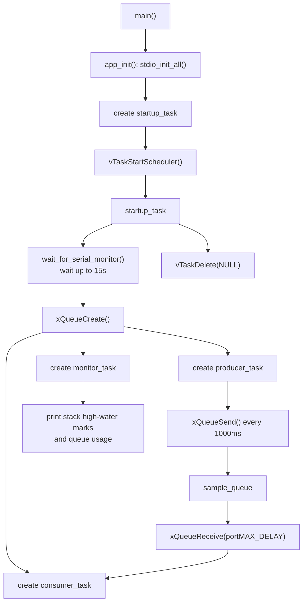
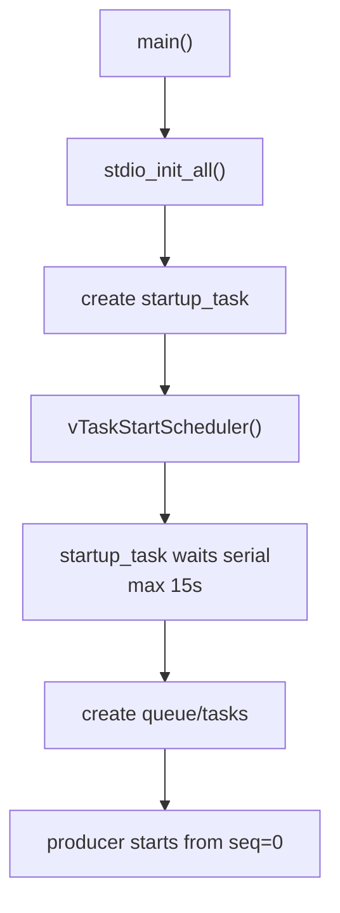

# 01. FreeRTOS Queue 与启动串口策略

日期：2026-05-28

板卡：Waveshare RP2350-PiZero / RP2350B

环境：VSCode + Pico SDK 2.2.0 + Ninja + FreeRTOS-Kernel

## 1. 本节目标

本节从最小 FreeRTOS 任务 demo 继续推进，目标是学习两个实际工程里很常见的问题：

1. 任务之间如何安全传递数据。
2. USB 串口启动日志如何尽量不丢，同时又不阻塞系统正常运行。

对应完成的工程变化：

1. 增加 `producer_task`、`consumer_task`、`monitor_task`。
2. 用 FreeRTOS Queue 在生产者和消费者之间传递消息。
3. 增加 `app_init` 初始化模块。
4. 增加 `startup_task`，在调度器启动后等待串口监视器，超时后继续运行。

## 2. 当前程序结构



关键代码位置：

| 内容                      | 位置             |
| ----------------------- | -------------- |
| `sample_message_t` 消息结构 | `main.c:13`    |
| 队列长度与串口等待参数             | `main.c:18`    |
| 生产者任务                   | `main.c:37`    |
| 消费者任务                   | `main.c:62`    |
| 监视任务                    | `main.c:79`    |
| 等待串口监视器                 | `main.c:95`    |
| 启动任务                    | `main.c:106`   |
| `main()` 启动调度器          | `main.c:123`   |
| `app_init()`            | `app_init.c:5` |

## 3. Queue 的核心理解

这次的消息结构是：

```c
typedef struct {
    uint32_t sequence;
    TickType_t produced_at;
} sample_message_t;
```

`producer_task` 每秒构造一个局部变量 `message`，然后调用：

```c
xQueueSend(sample_queue, &message, pdMS_TO_TICKS(100));
```

`consumer_task` 则调用：

```c
xQueueReceive(sample_queue, &message, portMAX_DELAY);
```

这里最重要的点是：FreeRTOS Queue 保存的是消息内容的拷贝，而不是 `message` 这个局部变量本身的地址。因此 `producer_task` 函数循环进入下一轮之后，消费者依然能安全收到之前发送的数据。

运行现象示例：

```text
Starting FreeRTOS queue demo
[producer] seq=0 tick=6230
[consumer] seq=0 produced_at=6230 latency=0
[monitor] tick=6231 producer_stack=392 consumer_stack=396 monitor_stack=482 queue_used=0 queue_free=4
```

这个输出说明：

| 字段                 | 含义                   |
| ------------------ | -------------------- |
| `seq=0`            | 生产者生成的第 0 条消息        |
| `produced_at=6230` | 消息生成时的 FreeRTOS tick |
| `latency=0`        | 消费者在同一个 tick 内收到消息   |
| `queue_used=0`     | monitor 查看时队列中没有积压   |
| `queue_free=4`     | 队列总长度为 4，当前 4 个槽位都空闲 |

工程思想：

1. 多任务之间优先通过 Queue、Semaphore、EventGroup、Task Notification 等同步机制通信。
2. 不要让任务互相直接读写一堆裸全局变量。
3. 消费者没有数据时应该阻塞等待，而不是在循环里反复轮询。

参考依据：

| API / 配置                    | 位置                                        |
| --------------------------- | ----------------------------------------- |
| `xQueueCreate` 宏            | `lib/FreeRTOS-Kernel/include/queue.h:149` |
| `xQueueSend` 宏              | `lib/FreeRTOS-Kernel/include/queue.h:513` |
| `xQueueReceive` 声明          | `lib/FreeRTOS-Kernel/include/queue.h:913` |
| `uxQueueMessagesWaiting` 声明 | `lib/FreeRTOS-Kernel/include/queue.h:932` |
| `uxQueueSpacesAvailable` 声明 | `lib/FreeRTOS-Kernel/include/queue.h:951` |

## 4. 周期任务与阻塞等待

`producer_task` 使用：

```c
vTaskDelayUntil(&last_wake_time, pdMS_TO_TICKS(1000));
```

它适合“每隔固定周期执行一次”的任务，例如采样、心跳、定时发送数据。

`consumer_task` 使用：

```c
xQueueReceive(sample_queue, &message, portMAX_DELAY);
```

它适合“没有数据就睡眠，有数据再继续”的任务，例如串口命令处理、传感器事件处理、日志输出。

对比：

| 写法                                  | 适合场景          |
| ----------------------------------- | ------------- |
| `vTaskDelay()`                      | 从现在开始延时一段时间   |
| `vTaskDelayUntil()`                 | 固定周期执行，降低周期漂移 |
| `xQueueReceive(..., portMAX_DELAY)` | 等事件，不空转       |

参考依据：

| API                 | 位置                                       |
| ------------------- | ---------------------------------------- |
| `vTaskDelay` 声明     | `lib/FreeRTOS-Kernel/include/task.h:859` |
| `vTaskDelayUntil` 宏 | `lib/FreeRTOS-Kernel/include/task.h:933` |

## 5. Release 构建下 `assert` 的坑

曾经出现的问题：烧录后没有 `[producer]`、`[consumer]`、`[monitor]` 输出。

根因是旧代码把有副作用的函数调用放进了 `configASSERT()`：

```c
configASSERT(xTaskCreate(...));
```

当前工程是 Release 构建，`build/CMakeCache.txt` 中有：

```text
CMAKE_BUILD_TYPE:STRING=Release
CMAKE_C_FLAGS_RELEASE:STRING=-g -O3 -DNDEBUG
```

而 `FreeRTOSConfig.h` 中：

```c
#define configASSERT(x) assert(x)
```

在定义了 `NDEBUG` 的 Release 构建下，标准 `assert(x)` 不会执行 `x`。所以 `xTaskCreate(...)` 被一起跳过，任务根本没有创建。

修正后的写法：

```c
const BaseType_t result = xTaskCreate(task_code, name, 512, NULL, priority, task_handle);
configASSERT(result == pdPASS);
```

工程思想：

1. 不要把有副作用的函数调用放进 `assert`。
2. `assert` 只负责检查结果，不负责执行关键动作。
3. Release / Debug 行为可能不同，尤其要小心 `NDEBUG`。

参考依据：

| 内容                            | 位置                                       |
| ----------------------------- | ---------------------------------------- |
| `create_task_or_panic()` 修正位置 | `main.c:29`                              |
| `configASSERT(x)` 定义          | `FreeRTOSConfig.h:63`                    |
| Release 构建类型                  | `build/CMakeCache.txt:51`                |
| Release C 编译参数含 `-DNDEBUG`    | `build/CMakeCache.txt:100`               |
| `xTaskCreate` 声明              | `lib/FreeRTOS-Kernel/include/task.h:385` |

## 6. USB 串口启动等待策略

最初为了避免打开串口监视器太慢导致日志丢失，尝试过两种方式。

### 6.1 固定等待

电子琴项目采用的方式：

```c
stdio_init_all();
sleep_ms(5000);
```

这种方式简单稳定，适合教学 demo。它不关心主机是否真的打开串口，只是给 Windows 枚举设备和人工打开串口监视器留时间。

参考依据：

| 项目                 | 位置                                                          |
| ------------------ | ----------------------------------------------------------- |
| 电子琴 `board_init()` | `C:/GraduationProject/code/electronic_piano/board_init.c:5` |
| `stdio_init_all()` | `C:/GraduationProject/code/electronic_piano/board_init.c:7` |
| 固定等待 5 秒           | `C:/GraduationProject/code/electronic_piano/board_init.c:8` |

### 6.2 无限等待 USB 连接状态

我们尝试过：

```c
while (!stdio_usb_connected()) {
    sleep_ms(10);
}
```

现象：板子可能卡住，Windows 甚至弹出“无法识别的 USB 设备”。

原因：`stdio_usb_connected()` 判断的并不是“COM 口已经出现在 Windows 设备列表里”，而更接近“USB CDC 串口已经被主机打开并设置 DTR”。如果把它放在太早的位置无限等待，反而可能影响初始化过程。

参考依据：

| 内容                                           | 位置                                                                                                 |
| -------------------------------------------- | -------------------------------------------------------------------------------------------------- |
| `stdio_usb_connected()` 声明                   | `C:/Users/Yukikaze/.pico-sdk/sdk/2.2.0/src/rp2_common/pico_stdio_usb/include/pico/stdio_usb.h:194` |
| `PICO_STDIO_USB_CONNECTION_WITHOUT_DTR` 配置说明 | `C:/Users/Yukikaze/.pico-sdk/sdk/2.2.0/src/rp2_common/pico_stdio_usb/include/pico/stdio_usb.h:150` |
| `stdio_usb_connected()` 实现                   | `C:/Users/Yukikaze/.pico-sdk/sdk/2.2.0/src/rp2_common/pico_stdio_usb/stdio_usb.c:289`              |
| 默认路径下调用 `tud_cdc_connected()`                | `C:/Users/Yukikaze/.pico-sdk/sdk/2.2.0/src/rp2_common/pico_stdio_usb/stdio_usb.c:294`              |

### 6.3 当前采用：启动任务中等待，超时继续

当前工程采用折中策略：

```text
main()
  -> app_init()
  -> create startup_task
  -> vTaskStartScheduler()

startup_task
  -> wait_for_serial_monitor()
  -> create queue and demo tasks
  -> vTaskDelete(NULL)
```

也就是：不在 `main()` 裸机阶段无限等待，而是进入 FreeRTOS 后，用一个启动任务等待串口连接。等待有 15 秒超时，超时后继续运行。

优点：

1. 如果调试终端及时打开，尽量从 `seq=0` 看到输出。
2. 如果没有调试终端，系统不会因为日志口无人监听而永久卡住。
3. 后续可以在 `startup_task` 中加入更多启动状态，例如传感器上电等待、配置加载、错误提示。

参考依据：

| 内容                          | 位置           |
| --------------------------- | ------------ |
| 串口等待超时参数                    | `main.c:20`  |
| `wait_for_serial_monitor()` | `main.c:95`  |
| `startup_task()`            | `main.c:106` |
| 启动任务创建                      | `main.c:126` |
| 调度器启动                       | `main.c:128` |

## 7. 初始化模块的意义

新增 `app_init` 模块后，`main()` 不再直接写板级初始化细节：

```c
int main(void) {
    app_init();
    create_task_or_panic(startup_task, "startup", tskIDLE_PRIORITY + 3, NULL);
    vTaskStartScheduler();
}
```

现在 `app_init()` 只做：

```c
void app_init(void) {
    stdio_init_all();
}
```

这看起来很薄，但工程上有价值：

1. 初始化入口明确。
2. 后续加入 GPIO、I2C、传感器电源、Flash 配置加载时，有固定位置。
3. `main()` 保持为系统启动流程，而不是硬件细节堆放处。

参考依据：

| 内容                | 位置                  |
| ----------------- | ------------------- |
| `app_init()` 声明   | `app_init.h:4`      |
| `app_init()` 实现   | `app_init.c:5`      |
| `app_init.c` 加入构建 | `CMakeLists.txt:40` |

## 8. 观察与诊断方法

本节用到的观察点：

| 观察内容                          | 用途                 |
| ----------------------------- | ------------------ |
| 串口输出是否从 `seq=0` 开始            | 判断启动等待是否有效         |
| `latency`                     | 判断生产者到消费者的延迟       |
| `queue_used` / `queue_free`   | 判断消费者是否跟得上生产者      |
| `uxTaskGetStackHighWaterMark` | 判断任务栈余量            |
| Windows USB 报错                | 判断 USB 初始化策略是否破坏枚举 |

当前运行较理想的现象：

```text
Starting FreeRTOS queue demo
[producer] seq=0 tick=6230
[consumer] seq=0 produced_at=6230 latency=0
[monitor] tick=6231 producer_stack=392 consumer_stack=396 monitor_stack=482 queue_used=0 queue_free=4
```

这表示：

1. 启动等待策略让业务输出从头可见。
2. Queue 没有积压。
3. 消费者几乎立即被唤醒。
4. 各任务栈目前还有余量。

## 9. 报错 / 问题修复

本节的问题都很适合复盘，因为它们不是单纯“代码写错”，而是 RTOS、构建模式、USB 串口状态共同作用后的工程现象。

| 问题                             | 现象                                             | 根因                                                                    | 修复 / 处理                                                  |
| ------------------------------ | ---------------------------------------------- | --------------------------------------------------------------------- | -------------------------------------------------------- |
| 烧录后仍看到 `[heartbeat]`           | 串口输出还是上一版任务名                                   | 板子上仍在跑旧固件，或新固件尚未成功烧录/重新连接串口                                           | 先确认重新编译烧录；旧输出不能当作新代码运行结果                                 |
| Queue demo 无输出                 | 只看到启动前/旧输出，或调度器启动后没有 producer/consumer/monitor | `xTaskCreate()` 被写进 `configASSERT()`，Release 下 `assert()` 不执行表达式      | 改成先执行 `xTaskCreate()`，再 `configASSERT(result == pdPASS)` |
| 固定等 3 秒仍从 `seq=5` 开始           | 打开串口监视器后前几条消息已经错过                              | 板子上电后自己倒计时，VSCode 串口关闭、枚举、重新打开可能超过 3 秒                                | 认识到“固定等待”和“等串口真的打开”不是一回事                                 |
| 启动前无限等 `stdio_usb_connected()` | COM8 不出现，甚至 Windows 报无法识别 USB 设备               | `stdio_usb_connected()` 更接近 CDC/DTR 连接状态，不等同于“COM 口已枚举”；过早无限等待会破坏启动节奏 | 不在 `main()` 裸机阶段无限等串口                                    |
| 串口等待与业务输出冲突                    | 既想等调试口，又不想系统永久卡死                               | 调试接口不能成为正式业务启动的硬依赖                                                    | 引入 `startup_task`：进入调度器后等待串口，最多 15 秒，随后继续运行              |

### 9.1 Release 下 `assert` 吃掉任务创建

旧写法：

```c
configASSERT(xTaskCreate(...));
```

当前构建是 Release，带 `-DNDEBUG`。标准 `assert(expr)` 在这种情况下不会执行 `expr`，所以 `xTaskCreate()` 整个被跳过。调度器启动后只有 idle/timer 相关任务，没有我们创建的业务任务。

修复后：

```c
const BaseType_t result = xTaskCreate(task_code, name, 512, NULL, priority, task_handle);
configASSERT(result == pdPASS);
```

参考依据：

| 内容                            | 位置                         |
| ----------------------------- | -------------------------- |
| 修复后的 `create_task_or_panic()` | `main.c:29`                |
| `configASSERT(x)` 定义          | `FreeRTOSConfig.h:63`      |
| Release 构建类型                  | `build/CMakeCache.txt:51`  |
| Release C flags 中的 `-DNDEBUG` | `build/CMakeCache.txt:100` |

经验：

```text
assert 只能检查结果，不要承载关键动作。
```

### 9.2 USB 串口等待策略的修正过程

尝试过三种策略：

| 策略           | 代码形态                                | 结果                     | 结论                      |
| ------------ | ----------------------------------- | ---------------------- | ----------------------- |
| 固定等待         | `stdio_init_all(); sleep_ms(3000);` | 有时仍错过 `seq=0..4`       | 简单但不保证等到人打开串口           |
| 启动前无限等待      | `while (!stdio_usb_connected())`    | COM 可能不出现，Windows 可能报错 | 不适合放在 `main()` 裸机阶段无限等待 |
| 启动任务中等待 + 超时 | `startup_task` 中等待最多 15 秒           | 能看到 `seq=0`，且不会永久卡死    | 当前采用                    |

当前流程：



参考依据：

| 内容                           | 位置                                                                                                 |
| ---------------------------- | -------------------------------------------------------------------------------------------------- |
| `stdio_usb_connected()` 声明   | `C:/Users/Yukikaze/.pico-sdk/sdk/2.2.0/src/rp2_common/pico_stdio_usb/include/pico/stdio_usb.h:194` |
| 默认实现调用 `tud_cdc_connected()` | `C:/Users/Yukikaze/.pico-sdk/sdk/2.2.0/src/rp2_common/pico_stdio_usb/stdio_usb.c:294`              |
| 当前等待函数                       | `main.c:95`                                                                                        |
| 当前启动任务                       | `main.c:106`                                                                                       |

经验：

1. USB CDC 的“设备枚举”“COM 口出现”“串口监视器打开”“DTR 置位”不是同一个状态。
2. 教学 demo 可以固定等几秒；正式工程更适合“检测 + 超时继续”。
3. 等待调试接口最好放入系统启动任务，而不是阻塞在裸 `main()` 里。

## 10. 本节工程经验

1. RTOS 的价值不只是“多线程”，更重要的是提供可控的阻塞、唤醒、同步、调度。
2. Queue 是任务之间传递数据的基本工具，比裸全局变量更安全。
3. 周期任务优先考虑 `vTaskDelayUntil()`，事件任务优先考虑阻塞等待。
4. Release 构建会改变 `assert` 行为，不要把关键动作写进 `assert`。
5. 嵌入式启动流程不要无限等待调试接口，正式工程要有超时和降级路径。
6. USB CDC 的“设备枚举”“COM 口出现”“串口被打开”“DTR 置位”不是同一个概念。
7. 初始化模块即使一开始很薄，也能为后续工程扩展留下清晰边界。

## 11. 后续建议

下一步可以继续沿着 Queue 往下学习：

1. 加入 `console_task`，通过 USB 串口输入命令。
2. 用 Queue 或 Task Notification 控制 producer 的发送周期。
3. 增加 `logger_task`，统一处理多任务日志输出。
4. 学习 Semaphore，用按键或模拟中断唤醒任务。
5. 学习 Software Timer，把周期事件从任务中拆出来。
