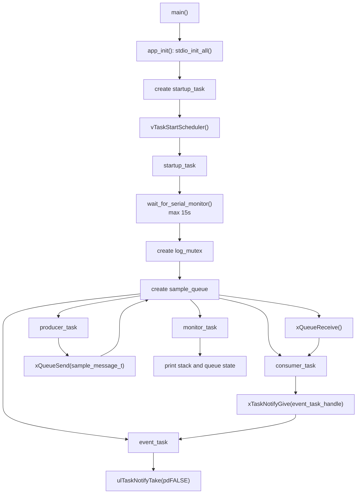

# 02. Mutex、Semaphore 与 Task Notification

日期：2026-05-30

板卡：Waveshare RP2350-PiZero / RP2350B

环境：VSCode + Pico SDK 2.2.0 + Ninja + FreeRTOS-Kernel

## 1. 本节目标

本阶段从 Queue demo 继续推进，重点学习 RTOS 里三类常见同步方式：

1. `Mutex`：保护共享资源，例如串口、SPI、I2C、SD 卡、墨水屏。
2. `Semaphore`：通知事件发生，可以是 binary，也可以是 counting。
3. `Task Notification`：直接通知某个任务，是更轻量的一对一事件通知机制。

最终代码保留的是 Task Notification 版本，但本节也记录了 Binary Semaphore 和 Counting Semaphore 的实验现象。

## 2. 当前程序结构



关键位置：

| 内容 | 位置 |
| --- | --- |
| 事件间隔与慢任务延时 | `main.c:20` |
| `log_mutex` | `main.c:29` |
| `log_printf()` | `main.c:43` |
| `consumer_task()` 发通知 | `main.c:98` |
| `event_task()` 等通知 | `main.c:109` |
| `monitor_task()` 观察状态 | `main.c:129` |
| `startup_task()` 创建任务 | `main.c:157` |

## 3. Mutex：保护共享资源

本节最先加入的是日志互斥锁：

```c
static SemaphoreHandle_t log_mutex = NULL;
```

所有任务不再直接 `printf()`，而是统一走：

```c
static void log_printf(const char *format, ...) {
    configASSERT(log_mutex != NULL);

    if (xSemaphoreTake(log_mutex, portMAX_DELAY) == pdPASS) {
        va_list args;
        va_start(args, format);
        vprintf(format, args);
        va_end(args);

        xSemaphoreGive(log_mutex);
    }
}
```

这一步的串口现象并不强烈，因为短 `printf()` 很多时候本来就不容易肉眼看出交叉。但工程意义很重要：

```text
没有 mutex：
  多个任务可能同时访问 printf / USB stdio

有 mutex：
  任意时刻只有一个任务进入 log_printf()
  一整条日志打印完成后，另一个任务才能打印
```

这为后续墨水屏、SD 卡、SPI 总线打基础。它们都属于共享资源，通常要明确“谁拥有访问权”。

参考依据：

| API / 配置 | 位置 |
| --- | --- |
| `configUSE_MUTEXES` | `FreeRTOSConfig.h:20` |
| `xSemaphoreCreateMutex()` | `lib/FreeRTOS-Kernel/include/semphr.h:735` |
| `xSemaphoreTake()` | `lib/FreeRTOS-Kernel/include/semphr.h:298` |
| `xSemaphoreGive()` | `lib/FreeRTOS-Kernel/include/semphr.h:460` |

## 4. Binary Semaphore：通知一次事件

Binary Semaphore 版本用于演示“某个事件发生了，叫醒另一个任务”。

实验逻辑：

```text
consumer_task 每处理 5 条 Queue 消息
    -> xSemaphoreGive(sample_event)

event_task
    -> xSemaphoreTake(sample_event, portMAX_DELAY)
    -> 打印 [event] 5 samples processed
```

观察现象：

```text
[consumer] seq=4 produced_at=8220 latency=0
[event] 5 samples processed
...
[consumer] seq=9 produced_at=13220 latency=0
[event] 10 samples processed
```

理解重点：

| 机制 | 含义 |
| --- | --- |
| `xSemaphoreGive()` | 事件发生，释放一次信号 |
| `xSemaphoreTake()` | 等待事件，等到后继续执行 |
| `portMAX_DELAY` | 没有事件时阻塞，不空转占 CPU |

Binary Semaphore 更像“门铃”或“开关”，它适合表达“有事件了”，不适合表达“已经积压了多少次事件”。

参考依据：

| API | 位置 |
| --- | --- |
| `xSemaphoreCreateBinary()` | `lib/FreeRTOS-Kernel/include/semphr.h:167` |
| `xSemaphoreTake()` | `lib/FreeRTOS-Kernel/include/semphr.h:298` |
| `xSemaphoreGive()` | `lib/FreeRTOS-Kernel/include/semphr.h:460` |

## 5. Counting Semaphore：累计多次事件

Counting Semaphore 版本用于演示“事件产生速度快于处理速度”时，事件计数如何积压。

实验参数：

```text
每 2 条样本产生 1 个事件
event_task 每处理 1 个事件后 delay 5000ms
计数最大值设为 8
```

观察现象：

```text
[consumer] queued sample event pending=8
[consumer] sample event counter full, drop event
[event] batch=7 samples_reported=14 pending_after_take=7
[monitor] ... queue=0/4 event_pending=8
```

这说明：

1. `queue=0/4`：producer 到 consumer 之间没有积压。
2. `event_pending=8`：真正积压的是后面的慢事件任务。
3. `counter full, drop event`：计数达到最大值后，再给信号会失败。
4. `pending_after_take=7`：event_task 消耗一次事件后，计数从 8 变成 7。

这类现象在真实工程里很常见：

```text
快速采样任务
    -> 慢速 SD 写入任务

快速状态更新
    -> 慢速墨水屏刷新任务
```

如果只需要知道“欠了几次活”，Counting Semaphore 很合适；如果每次事件都带有具体数据，就应该用 Queue 保存数据内容。

参考依据：

| API / 配置 | 位置 |
| --- | --- |
| `configUSE_COUNTING_SEMAPHORES` | `FreeRTOSConfig.h:22` |
| `xSemaphoreCreateCounting()` | `lib/FreeRTOS-Kernel/include/semphr.h:1025` |
| `uxSemaphoreGetCount()` | `lib/FreeRTOS-Kernel/include/semphr.h:1177` |

## 6. Task Notification：直接通知某个任务

当前最终代码使用 Task Notification 替代事件 semaphore：

```c
const BaseType_t result = xTaskNotifyGive(event_task_handle);
configASSERT(result == pdPASS);
```

`event_task` 使用：

```c
const uint32_t pending_before_take = ulTaskNotifyTake(pdFALSE, portMAX_DELAY);
```

核心区别是：Task Notification 不创建独立的 semaphore 对象，而是把一个通知值放在目标任务自己的 TCB 里。

```text
Semaphore：
  consumer_task -> sample_event -> event_task

Task Notification：
  consumer_task -> event_task 的任务通知值
```

本节使用 `pdFALSE`，表示 `ulTaskNotifyTake()` 返回时不清零，只把通知值减 1。因此它可以像 counting semaphore 一样累计通知。

观察现象：

```text
[consumer] notified event task at sample=74
[event] batch=16 samples_reported=32 pending_before_take=23
...
[consumer] notified event task at sample=82
[event] batch=17 samples_reported=34 pending_before_take=25
```

`pending_before_take` 的含义是：

```text
event_task 这次取通知之前，自己身上已经积压了多少个通知。
```

参考依据：

| 内容 | 位置 |
| --- | --- |
| Task Notification 默认启用 | `lib/FreeRTOS-Kernel/include/FreeRTOS.h:2785` |
| 默认通知数组长度为 1 | `lib/FreeRTOS-Kernel/include/FreeRTOS.h:2789` |
| `xTaskNotifyGive()` 宏 | `lib/FreeRTOS-Kernel/include/task.h:2987` |
| `xTaskNotifyGive()` 使用 `eIncrement` | `lib/FreeRTOS-Kernel/include/task.h:2981` |
| `ulTaskNotifyTake()` 宏 | `lib/FreeRTOS-Kernel/include/task.h:3180` |
| `ulTaskNotifyTake()` 参数说明 | `lib/FreeRTOS-Kernel/include/task.h:3156` |
| 内核中通知值递增 | `lib/FreeRTOS-Kernel/tasks.c:7869` |
| 内核中通知值减 1 | `lib/FreeRTOS-Kernel/tasks.c:7699` |

## 7. `pending_before_take` 为什么不等间隔增长

实际观察到的现象：

```text
pending_before_take=43
pending_before_take=44
pending_before_take=46
```

这不是异常，而是由两个周期不整除造成的：

```text
consumer_task 通知周期：每 2 条样本一次，大约 2 秒一次
event_task 处理周期：每处理一次后 delay 5 秒
```

`event_task` 每次取通知时会消耗 1 个通知，同时在它延时的 5 秒里，`consumer_task` 还会继续发通知。

近似公式：

```text
下一次 pending = 上一次 pending - 1 + 这段时间新来的通知数
```

如果 5 秒里来了 2 次通知：

```text
43 - 1 + 2 = 44
```

如果 5 秒里来了 3 次通知：

```text
44 - 1 + 3 = 46
```

所以 `+1`、`+2` 混在一起很正常。这个现象也说明 RTOS 调度不是“按日志行机械排队”，而是由 tick、任务阻塞、唤醒和优先级共同决定。

## 8. 几种机制的对比

| 机制 | 解决什么问题 | 是否传数据 | 是否保护资源 | 是否累计事件 | 典型场景 |
| --- | --- | --- | --- | --- | --- |
| Queue | 任务间传递数据 | 是 | 否 | 队列容量内可累计 | 传感器数据、日志消息、显示命令 |
| Mutex | 保护共享资源 | 否 | 是 | 否 | 串口、SPI、I2C、SD 卡、墨水屏 |
| Binary Semaphore | 通知一次事件 | 否 | 否 | 不适合累计 | 按键、DMA 完成、BUSY 结束 |
| Counting Semaphore | 累计事件次数或资源数量 | 否 | 否 | 是 | 缓冲块数量、待处理批次 |
| Task Notification | 直接通知某个任务 | 可传简单值 | 否 | 可用作计数 | ISR 唤醒专属任务、轻量一对一通知 |

一句话记忆：

```text
Queue 传内容。
Mutex 管所有权。
Semaphore 发信号。
Task Notification 直接敲某个任务的门。
```

## 9. 报错 / 问题修复

| 问题 | 现象 | 根因 | 处理 |
| --- | --- | --- | --- |
| Mutex 版本现象不明显 | 除首行提示变化外，看不出明显差异 | mutex 主要防止潜在并发访问问题，短日志不一定会肉眼交叉 | 用工程角度理解它：保护 `printf`，后续可迁移到 SPI/SD/墨水屏 |
| Binary Semaphore 不适合展示积压 | 连续事件可能只表现为“有事件” | binary semaphore 主要表达有/无，不表达数量 | 用 Counting Semaphore 演示 pending 积压 |
| Counting Semaphore 计数满 | 出现 `counter full, drop event` | 事件产生速度大于事件处理速度，计数达到最大值 | 明确设置溢出策略：丢弃、合并、提高处理能力或改用 Queue |
| Task Notification 的 pending 不等间隔 | `pending_before_take` 有时 +1，有时 +2 | 2 秒通知周期与 5 秒处理周期不整除，加上调度时序 | 按 `上次 - 1 + 新通知数` 理解 |
| Task Notification 目标句柄风险 | 如果先创建 consumer，再创建 event，consumer 可能通知空句柄 | `xTaskNotifyGive()` 需要有效的目标任务句柄 | 当前代码先创建 `event_task`，再创建 `consumer_task` |

## 10. 工程思想

1. RTOS 学习不只是 API 学习，更重要的是判断“这是数据、资源、事件，还是专属任务通知”。
2. 共享外设要有所有权设计。串口日志是练习场，SPI、SD 卡、墨水屏才是真正会踩坑的地方。
3. 慢任务必须考虑积压。计数满以后要有策略，不能假装不会满。
4. Task Notification 很轻量，但架构上更绑定目标任务，适合一对一，不适合表达公共事件总线。
5. `pdFALSE` 和 `pdTRUE` 会改变通知语义：`pdFALSE` 类似 counting semaphore，`pdTRUE` 类似 binary semaphore。
6. 日志里的 tick、pending、stack high-water mark 都是观察系统状态的窗口，不能只看“有没有打印”。

## 11. 后续建议

下一阶段可以学习 Software Timer，原因是当前 demo 已经有多个“时间相关行为”：

```text
producer_task 每 1 秒产生样本
monitor_task 每 2 秒打印状态
event_task 每 5 秒模拟慢处理
```

Software Timer 可以把部分周期性动作从任务循环中拆出来，继续学习“定时事件如何进入 RTOS 系统”。

另一个可选方向是 Serial CLI：通过串口命令动态调整 `SAMPLE_EVENT_INTERVAL` 或 `EVENT_TASK_WORK_MS`，让系统从“只能看输出”变成“可以交互控制”。
