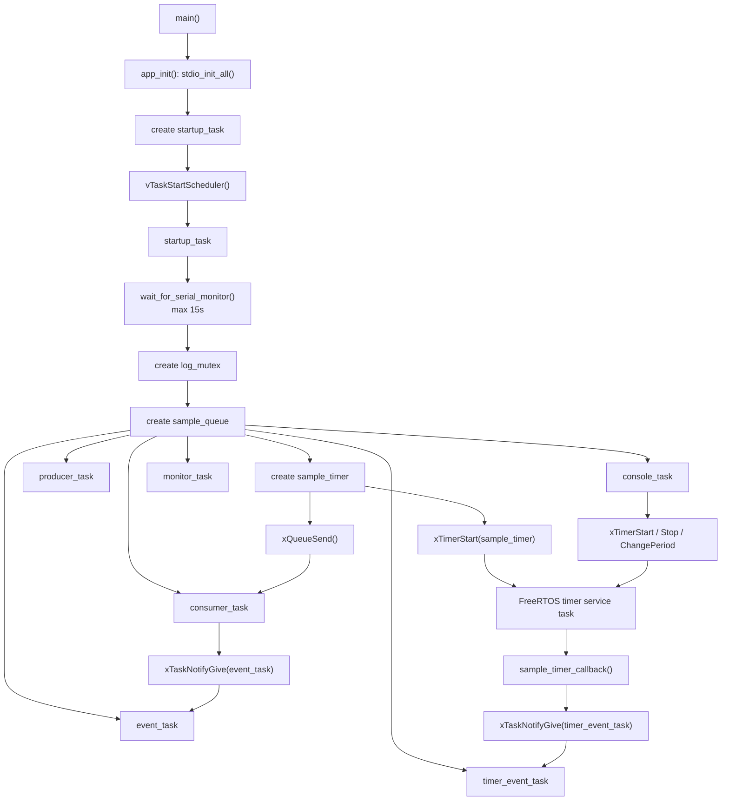
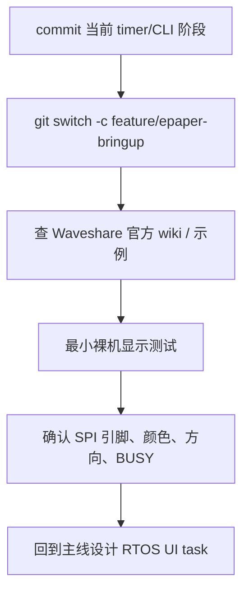

# 03. Software Timer 与串口 CLI

日期：2026-05-31

板卡：Waveshare RP2350-PiZero / RP2350B

环境：VSCode + Pico SDK 2.2.0 + Ninja + FreeRTOS-Kernel

## 1. 本节目标

本阶段在前面的 Queue、Mutex、Task Notification 基础上继续加入两个能力：

1. `Software Timer`：用 RTOS 的软件定时器周期性产生事件。
2. 串口 CLI：通过 USB CDC 串口发送命令，动态观察和控制任务行为。

这一步的重点不是“让板子多打印几行”，而是建立一个更接近真实工程的调试入口：

```text
上位机串口命令
    -> console_task
    -> 控制软件定时器 / 调整日志模式 / 查询运行状态
```

## 2. 当前程序结构



关键位置：

| 内容 | 位置 |
| --- | --- |
| 软件定时器周期、CLI 缓冲区、串口等待参数 | `main.c:26` |
| `sample_timer` 与任务句柄 | `main.c:39` |
| 定时器回调 `sample_timer_callback()` | `main.c:152` |
| 定时器事件任务 `timer_event_task()` | `main.c:159` |
| CLI 帮助文本 | `main.c:207` |
| CLI 状态查询 `print_console_stats()` | `main.c:211` |
| `timer` 命令处理 | `main.c:227` |
| `quiet` / `verbose` 命令 | `main.c:281` |
| `console_task()` 非阻塞读取串口输入 | `main.c:306` |
| `sample_timer = xTimerCreate(...)` | `main.c:399` |
| `xTimerStart(sample_timer, 0)` | `main.c:413` |

## 3. Software Timer 是什么

FreeRTOS 的软件定时器不是 RP2350 硬件定时器外设本身，而是 RTOS 内核提供的一套“到点执行回调”的机制。

它依赖系统 tick 和一个 timer service task：

```text
tick 推动时间前进
    -> FreeRTOS 判断某个软件定时器到期
    -> timer service task 执行 callback
```

本项目创建了一个自动重装载的软件定时器：

```c
sample_timer = xTimerCreate("sample_timer",
                            pdMS_TO_TICKS(SOFTWARE_TIMER_PERIOD_MS),
                            pdTRUE,
                            NULL,
                            sample_timer_callback);
```

参数含义：

| 参数 | 当前值 | 含义 |
| --- | --- | --- |
| name | `"sample_timer"` | 调试用名字 |
| period | `pdMS_TO_TICKS(3000)` | 每 3000ms 到期一次 |
| auto reload | `pdTRUE` | 到期后自动重新开始 |
| timer ID | `NULL` | 本 demo 不需要额外上下文 |
| callback | `sample_timer_callback` | 到期后由 timer service task 调用 |

参考依据：

| API / 配置 | 位置 |
| --- | --- |
| `configUSE_TIMERS` | `FreeRTOSConfig.h:49` |
| `configTIMER_TASK_PRIORITY` | `FreeRTOSConfig.h:50` |
| `configTIMER_QUEUE_LENGTH` | `FreeRTOSConfig.h:51` |
| `configTIMER_TASK_STACK_DEPTH` | `FreeRTOSConfig.h:52` |
| `TimerCallbackFunction_t` | `lib/FreeRTOS-Kernel/include/timers.h:83` |
| `xTimerCreate()` | `lib/FreeRTOS-Kernel/include/timers.h:230` |
| `xTimerStart()` | `lib/FreeRTOS-Kernel/include/timers.h:507` |
| timer command queue 说明 | `lib/FreeRTOS-Kernel/include/timers.h:462` |
| 内核中的 `xTimerQueue` | `lib/FreeRTOS-Kernel/timers.c:149` |
| timer service task 创建 | `lib/FreeRTOS-Kernel/timers.c:237` |
| `prvTimerTask` 主循环 | `lib/FreeRTOS-Kernel/timers.c:748` |

## 4. 为什么 callback 里只做通知

当前 callback 很短：

```c
static void sample_timer_callback(TimerHandle_t timer) {
    (void)timer;

    const BaseType_t result = xTaskNotifyGive(timer_event_task_handle);
    configASSERT(result == pdPASS);
}
```

它没有直接打印复杂日志，也没有做慢操作，而是把事件交给 `timer_event_task()`：

```text
sample_timer_callback()
    -> xTaskNotifyGive(timer_event_task_handle)
    -> timer_event_task 被唤醒
    -> 打印 [timer] expiration=...
```

原因是：软件定时器 callback 虽然不是中断上下文，但它运行在 FreeRTOS 的 timer service task 里。如果 callback 长时间阻塞、打印过慢、等待外设，就会拖慢其他软件定时器命令和回调。

所以工程习惯是：

```text
callback 只做轻量通知
真正工作交给普通任务
```

这和前面学的 Task Notification 正好接上了：软件定时器负责“到点”，任务负责“干活”。

## 5. 串口 CLI 的工作方式

CLI 任务每隔很短时间轮询一次 USB CDC 输入：

```c
const int input = getchar_timeout_us(0);
```

这里的 `0` 表示不等待。没有字符时立刻返回 `PICO_ERROR_TIMEOUT`，任务随后 `vTaskDelay()`，避免空转占满 CPU。

完整路径是：

```text
串口监视器发送字符
    -> getchar_timeout_us(0)
    -> console_task 放入 line buffer
    -> 收到 '\n' 或 '\r'
    -> handle_console_command()
```

因此串口发送区必须选择 `LF` 或 `CRLF`。如果行尾设置为“无”，板子确实收到了字符，但一直等不到“这一行结束”的信号，命令就停在 buffer 里不会执行。

参考依据：

| API / 常量 | 位置 |
| --- | --- |
| `getchar_timeout_us()` | `C:/Users/Yukikaze/.pico-sdk/sdk/2.2.0/src/rp2_common/pico_stdio/include/pico/stdio.h:92` |
| `stdio_getchar_timeout_us()` | `C:/Users/Yukikaze/.pico-sdk/sdk/2.2.0/src/rp2_common/pico_stdio/include/pico/stdio.h:92` |
| `PICO_ERROR_TIMEOUT` | `C:/Users/Yukikaze/.pico-sdk/sdk/2.2.0/src/common/pico_base_headers/include/pico/error.h:26` |

## 6. 当前 CLI 命令

| 命令 | 作用 | 观察重点 |
| --- | --- | --- |
| `help` | 打印命令列表 | 验证 CLI 任务在线 |
| `stats` | 打印 tick、queue、timer、stack 状态 | 观察运行状态 |
| `quiet` | 关闭 producer/consumer/event/monitor 详细日志 | 降低刷屏速度 |
| `verbose` | 恢复详细日志 | 回到完整观察模式 |
| `timer start` | 启动软件定时器 | `[timer]` 重新出现 |
| `timer stop` | 停止软件定时器 | `[timer]` 停止刷新 |
| `timer <ms>` | 修改周期 | 例如 `timer 1000` 后 1 秒一次 |

`stats` 输出里的几个字段：

| 字段 | 含义 |
| --- | --- |
| `tick` | 当前 RTOS tick |
| `queue=0/4` | 当前 queue 已用空间 / 剩余空间 |
| `timer_active=1` | 软件定时器是否处于 active 状态 |
| `timer_period_ticks=1000` | 当前定时器周期，以 tick 为单位 |
| `detail_logs=0` | 当前是否打开详细日志 |
| `stack_*` | 各任务剩余栈空间的 high water mark |

本项目当前 `configTICK_RATE_HZ` 为 1000，见 `FreeRTOSConfig.h:14`，所以大多数时候 `1000 ticks` 可以近似理解为 `1000ms`。

## 7. 本节观察到的现象

软件定时器正常工作时可以看到：

```text
[timer] expiration=1 pending_before_take=1 tick=...
[timer] expiration=2 pending_before_take=1 tick=...
```

发送 `quiet` 后：

```text
[console] detail logs disabled; timer and console output remain visible
```

此后详细日志停止刷屏，但 `[timer]` 和 `[console]` 仍保留。这是故意设计的：`quiet` 是为了让交互更容易观察，而不是把所有输出都关掉。

发送 `timer stop`：

```text
[console] timer stop ok
```

发送 `timer 1000`：

```text
[console] timer period=1000 ms ok
```

再发送 `stats`：

```text
[console] tick=... queue=0/4 timer_active=1 timer_period_ticks=1000 detail_logs=0 ...
```

这说明命令已经进入 `console_task()`，并通过 FreeRTOS timer API 改变了软件定时器状态。

## 8. 报错 / 问题修复

### 8.1 发送 `quiet` 后没有反应

现象：

```text
串口监视器显示已经发送 quiet
但板子仍然持续打印详细日志
```

排查：

1. `console_task()` 不是按单个字符立即执行命令。
2. 它需要收到 `\r` 或 `\n` 才会调用 `handle_console_command()`。
3. 串口发送区如果行尾设置为“无”，命令会停留在 line buffer 中。

根因：

```text
缺少 LF / CRLF 行尾，命令没有被提交。
```

修复：

```text
串口监视器发送设置改为 LF 或 CRLF。
```

经验：

以后写串口 CLI 时，最好在帮助文本里明确提示：

```text
send with LF/CRLF
```

当前代码已经在 `help` 输出里加入了这个提示。

### 8.2 日志跳得太快，看不清命令效果

现象：

```text
producer / consumer / event / monitor / timer 都在打印
输入命令后很难看清变化
```

修复：

加入 `quiet` / `verbose`：

```text
quiet   -> 关闭详细日志，只保留 console 和 timer
verbose -> 恢复完整日志
```

经验：

调试输出不是越多越好。真实工程里常见做法是给日志分级，或者提供运行时开关。

### 8.3 不同 RP2350-PiZero 的 Run 烧录表现不同

现象：

1. 早先那块板子识别为 `COM8`，直接 `Run Project (USB)` 不稳定。
2. 这次换的同型号 RP2350-PiZero 识别为 `COM5`，直接点击 Run 可以烧录。

暂定结论：

```text
这个问题暂时不像是“RP2350-PiZero 型号必然不支持直接 Run”，
更像是具体板子状态、USB 线、USB 口、Windows 设备状态或 bootrom 进入方式差异。
```

当前可靠流程仍然保留：

```text
手动 BOOTSEL + UF2
或
手动 BOOTSEL + VSCode Run Project
```

后续如果要彻底排查，需要拿多块板子、同一根线、同一 USB 口做交叉测试。

## 9. 和硬件定时器的区别

软件定时器：

```text
由 FreeRTOS 管理
适合做任务级周期事件
回调运行在 timer service task
精度受 tick 和调度影响
```

硬件定时器：

```text
由芯片外设提供
适合做更高精度或更底层的时间事件
通常会触发中断
中断里应尽量短，只通知任务
```

在本项目现阶段，软件定时器更适合学习 RTOS 机制；等后续涉及采样、PWM、精确节拍或低功耗唤醒，再引入硬件定时器会更自然。

## 10. 墨水屏下一步怎么接

墨水屏已经到手，但不建议直接把驱动合进当前主线。更稳妥的路线是先开一个独立分支做 bring-up：

```text
feature/epaper-bringup
```

原因：

1. 墨水屏涉及 SPI、CS、DC、RST、BUSY 等具体引脚。
2. 刷新过程慢，容易阻塞任务。
3. 需要先验证 Waveshare 示例、屏幕颜色、刷新方向、busy 等待逻辑。
4. 确认硬件链路正常后，再回到 RTOS 主线设计 `ui_task`。

推荐验证顺序：



未来 RTOS 里的显示结构可以这样设计：

```text
console_task / timer_event_task / monitor_task
    -> display_queue
    -> ui_task
    -> e-Paper driver
```

也就是说，其他任务不直接操作墨水屏，而是把显示请求发到队列里。`ui_task` 独占 SPI 和墨水屏刷新流程，这样更容易控制慢外设和共享资源。

这一点正好把前面学过的内容串起来：

| 已学概念 | 后续在墨水屏里的用途 |
| --- | --- |
| Queue | 传递显示请求 |
| Mutex | 保护 SPI / 日志 / 共享显示缓冲 |
| Task Notification | 通知 UI task 有局部更新 |
| Software Timer | 定时刷新状态页或低频刷新 |
| CLI | 手动触发清屏、刷新、切换页面 |

官方资料定位：

| 资料 | 位置 |
| --- | --- |
| Waveshare 2.15inch e-Paper HAT+ (G) wiki | https://www.waveshare.com/wiki/2.15inch_e-Paper_HAT%2B_(G) |
| Waveshare wiki: 工作电压、接口、颜色、分辨率 | 页面 `Overview` / `Parameters` |
| Waveshare wiki: RP2350 连接说明 | 页面 `Hardware Connection` / `For RP2350` |

## 11. 小结

这一章的核心收获是：

1. 软件定时器适合做 RTOS 层面的周期事件。
2. 定时器 callback 应保持短小，把工作交给普通任务。
3. 串口 CLI 可以作为板级程序的调试入口。
4. CLI 命令通常需要明确的行结束符，`LF` / `CRLF` 很关键。
5. `quiet` / `verbose` 这种运行时日志开关能明显提升调试体验。
6. 墨水屏很适合作为下一阶段硬件外设，但应先在独立分支验证。
