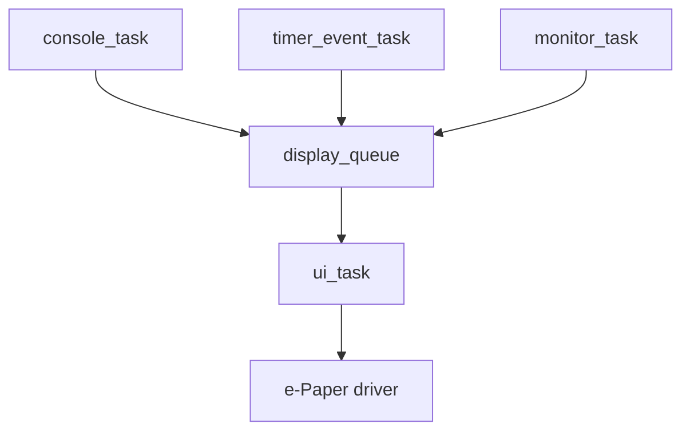

# 04. 墨水屏 Bring-up 实验

日期：2026-06-06

分支：`feature/epaper-bringup`

硬件：Waveshare RP2350-PiZero + Waveshare 2.15inch e-Paper HAT+ (G)

## 1. 本实验目标

这个分支先不把墨水屏接入 FreeRTOS 主线，而是把默认 `FreeRTOS_Training` 目标临时改成最小 Pico SDK 墨水屏例程：

```text
FreeRTOS_Training
    -> 初始化 USB CDC 串口
    -> 等待串口监视器，最多 15s
    -> 初始化 SPI/GPIO
    -> 初始化 2.15inch e-Paper HAT+ (G)
    -> 刷新一次四色测试图
    -> 让屏幕进入 sleep
```

这样可以先确认硬件链路和屏幕驱动没问题，再回到主线设计 `ui_task`。

## 2. 官方资料定位

| 内容 | 位置 |
| --- | --- |
| 屏幕 wiki | https://www.waveshare.com/wiki/2.15inch_e-Paper_HAT%2B_(G) |
| 屏幕 manual | https://www.waveshare.com/wiki/2.15inch_e-Paper_HAT%2B_(G)_Manual |
| 屏幕 demo zip | https://files.waveshare.com/wiki/common/2in15_e-Paper_G.zip |
| RP2350-PiZero wiki | https://www.waveshare.com/wiki/RP2350-PiZero |
| RP2350-PiZero 原理图 PDF | https://files.waveshare.com/wiki/RP2350-PiZero/RP2350-PiZero.pdf |

参考重点：

| 资料点 | 位置 |
| --- | --- |
| 分辨率、颜色、刷新时间 | 屏幕 manual `Overview` / `Parameters` |
| SPI 时序 mode 0 | 屏幕 manual `Communication Method` |
| 四色 2 bit/px 打包方式 | 屏幕 manual `Programming Principle` |
| Raspberry Pi HAT 引脚 | 屏幕 manual `Raspberry Pi` / `Hardware Connection` |
| RP2350-PiZero 40Pin 映射 | RP2350-PiZero 原理图 PDF 第 1 页 `40Pin OUT` |
| 官方 C 初始化序列 | demo zip `RaspberryPi_JetsonNano/c/lib/e-Paper/EPD_2in15g.c` |

## 3. 当前引脚默认值

当前例程按 RP2350-PiZero 40-pin 直插 HAT 使用方式设置：

| e-Paper 信号 | Raspberry Pi HAT 信号 | RP2350-PiZero 默认 GPIO |
| --- | --- | --- |
| DIN | SPI MOSI | `GPIO11` |
| CLK | SPI SCLK | `GPIO10` |
| CS | CE0 | `GPIO8` |
| DC | BCM25 | `GPIO25` |
| RST | BCM17 | `GPIO17` |
| BUSY | BCM24 | `GPIO24` |
| PWR | BCM18 | `GPIO18` |

默认值在 `epaper/epaper_2in15g.h`。本次直插实测已经验证这组引脚可用。

## 4. 构建目标

直插 HAT 会挡住 RP2350-PiZero 的 BOOT/RESET 按键。为了避免 VSCode Run 继续烧录主线 RTOS demo，本分支让默认目标直接运行墨水屏 bring-up：

```text
FreeRTOS_Training
```

手动构建默认目标：

```powershell
cmake --build build --target FreeRTOS_Training
```

或者直接使用 VSCode Pico SDK 的 Run。此时默认固件入口就是 `main.c` 里的墨水屏测试，而不是 RTOS demo。

## 5. 实测现象

本次实测成功：

```text
FreeRTOS_Training branch epaper bring-up
2.15inch e-Paper HAT+ (G), direct-plug test
pins: spi=spi1 mosi=11 sck=10 cs=8 dc=25 rst=17 busy=24 pwr=18
refresh is slow; this demo performs one full refresh then sleeps the panel
io init done, busy=0
init panel...
panel init done, busy=1
draw test pattern...
display frame, please wait about 20 seconds...
display command completed, busy=1
keep panel powered for inspection before sleep...
sleep panel
done; reset or power-cycle the board to rerun the one-shot refresh demo
```

屏幕现象：

```text
上电后数秒内快速刷新
随后色块依次显示
最终显示红、黄、白、黑四色色带
```

这说明：

1. 直插 HAT 方向正确。
2. `PWR`、`RST`、`BUSY` 控制脚有效。
3. SPI `MOSI/SCK/CS/DC` 通信有效。
4. 四色 2 bit/px 打包方向正确。
5. 面板 sleep 流程可用。

## 6. 串口输出为什么一开始滞后

初版现象：

```text
屏幕先完成刷新
串口监视器后来才显示后半段日志
```

原因：

```text
stdio_init_all()
    -> 程序立刻 printf
    -> 但 USB CDC 串口监视器还没真正连接
    -> 前面的日志被丢掉
    -> 屏幕刷新是阻塞过程
    -> 刷新结束后串口才显示后半段日志
```

修复：

```c
static void wait_for_serial_monitor(void) {
    const absolute_time_t deadline = make_timeout_time_ms(SERIAL_CONNECT_TIMEOUT_MS);

    while (!stdio_usb_connected() && (absolute_time_diff_us(get_absolute_time(), deadline) > 0)) {
        sleep_ms(10);
    }

    sleep_ms(SERIAL_READY_DELAY_MS);
}
```

并在关键日志后调用：

```c
stdio_flush();
```

修复后现象：

```text
先看到串口初始化日志
再看到 init panel / display frame
然后屏幕开始刷新
```

相关位置：

| 内容 | 位置 |
| --- | --- |
| 串口等待参数 | `main.c:8` |
| `wait_for_serial_monitor()` | `main.c:15` |
| 关键日志 `stdio_flush()` | `main.c:84` |

## 7. 报错 / 问题修复

### 7.1 默认目标烧错

现象：

```text
串口仍然出现 [producer]、[consumer]、[timer]
墨水屏没有变化
```

根因：

```text
VSCode Run 仍然烧录主线 RTOS demo，或者 CMake 目标没有切到墨水屏例程。
```

修复：

```text
在实验分支中直接把默认 FreeRTOS_Training 目标改成墨水屏 bring-up。
```

### 7.2 `panel init timeout`

可能原因：

1. HAT 没有插稳。
2. `BUSY` 引脚映射不对。
3. `PWR` 没有拉高。
4. 屏幕还处在异常忙状态。

优先检查：

```text
GPIO24 -> BUSY
GPIO18 -> PWR
HAT 方向和 40pin 是否完全对齐
```

### 7.3 `display timeout`

可能原因：

1. SPI 引脚不对。
2. `CS` / `DC` / `RST` 控制脚不对。
3. 屏幕刷新本来很慢，但超时阈值不够。

优先检查：

```text
GPIO11 -> MOSI
GPIO10 -> SCLK
GPIO8  -> CS
GPIO25 -> DC
GPIO17 -> RST
```

### 7.4 屏幕刷新了但颜色不对

可能原因：

1. 2 bit/px 打包顺序不对。
2. 屏幕方向与预期不同。
3. 面板温度太低，四色墨水屏可能出现偏色。

当前打包方式来自 manual 的 `Programming Principle`：

```text
black  = 00b
white  = 01b
yellow = 10b
red    = 11b
```

四个像素合成一个 byte：

```text
p0 p1 p2 p3 -> b7..b6 b5..b4 b3..b2 b1..b0
```

## 8. 后续接回 FreeRTOS 主线

裸机 bring-up 已经成功，后续主线应设计成：



重点原则：

1. 只有 `ui_task` 直接访问墨水屏。
2. 其他任务通过 queue 发送显示请求。
3. 刷新很慢，不应该在 timer callback 或普通业务任务里直接刷屏。
4. 后续可以用 CLI 命令触发 `screen test`、`screen clear`、`screen sleep`。

官方 manual 的 `Precautions` 提到，使用墨水屏时建议刷新间隔至少 180s，并且不用时进入 sleep 或断电。因此后续 RTOS 集成时需要限制刷新频率。
