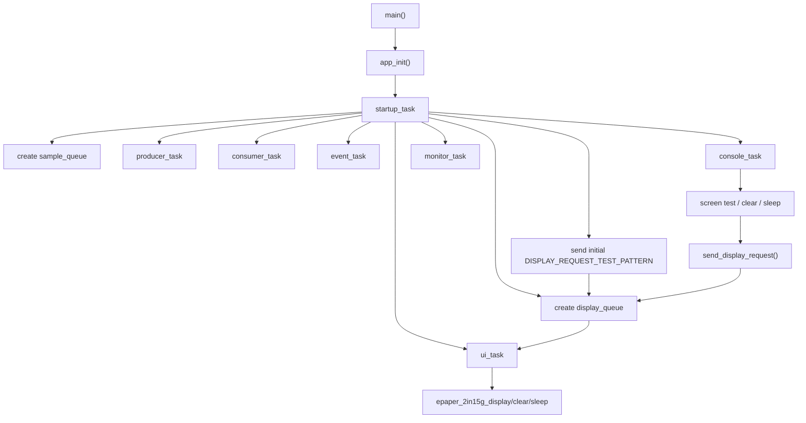
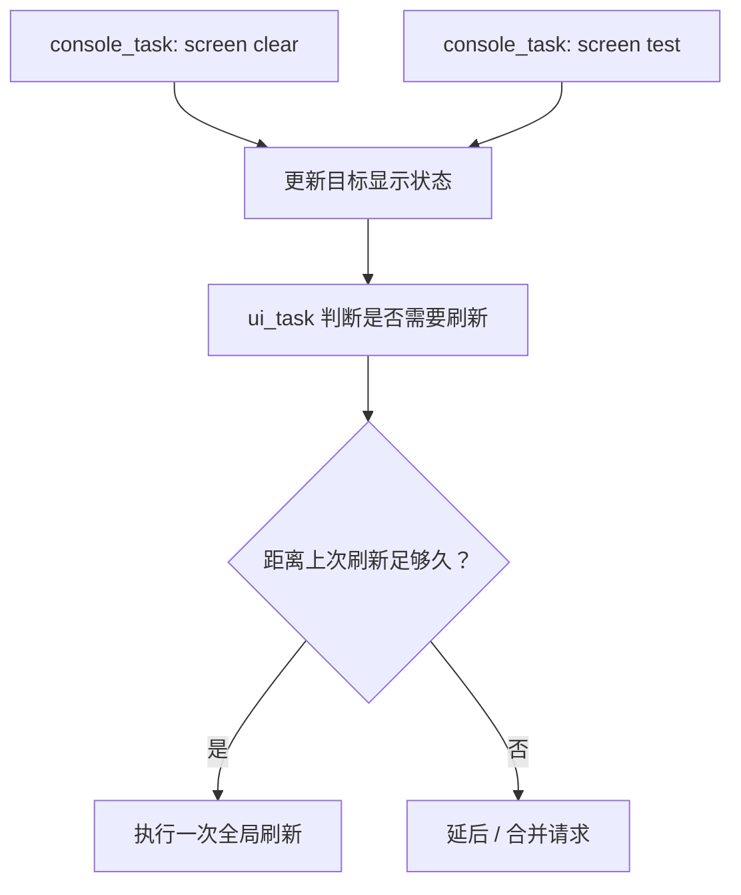

# 05. RTOS 墨水屏 UI Task 与串口控制

日期：2026-06-07

分支：`feature/rtos-epaper-ui`

硬件：Waveshare RP2350-PiZero + Waveshare 2.15inch e-Paper HAT+ (G)

## 1. 本节目标

这一节把前面单独验证过的墨水屏驱动接回 FreeRTOS 主线，但没有让所有任务都直接操作屏幕，而是新增一个专门的 `ui_task`：

```text
console_task / startup_task
    -> display_queue
    -> ui_task
    -> epaper_2in15g driver
```

核心思想是：慢外设由专门任务独占，其他任务只提交请求。

这样做的好处是：

1. 墨水屏刷新很慢，不会把串口命令解析逻辑卡死。
2. SPI/GPIO/屏幕状态集中在 `ui_task`，不会被多个任务同时访问。
3. `display_queue` 可以直观看到“请求排队”和“队列满”的现象。
4. 后续要加入刷新限频、请求合并、页面状态机时，有清晰入口。

## 2. 当前程序结构



关键位置：

| 内容 | 位置 |
| --- | --- |
| 显示请求类型 `display_request_type_t` | `main.c:25` |
| `display_queue` 句柄 | `main.c:50` |
| CLI 显示请求发送函数 `send_display_request()` | `main.c:143` |
| 墨水屏初始化封装 `prepare_display_panel()` | `main.c:237` |
| 屏幕独占任务 `ui_task()` | `main.c:253` |
| CLI 命令解析 `handle_console_command()` | `main.c:369` |
| 串口输入任务 `console_task()` | `main.c:413` |
| `display_queue = xQueueCreate(...)` | `main.c:510` |
| 创建 `ui_task` / `console_task` | `main.c:523` / `main.c:528` |
| 上电默认发一次测试图请求 | `main.c:545` |

## 3. 为什么不让 console 直接刷屏

`console_task` 的职责是读串口、拼接命令、解析命令。如果它直接调用墨水屏驱动，那么一条 `screen test` 会让它在刷新期间长时间停住。

当前做法是：

```text
console_task
    -> 解析 screen test
    -> xQueueSend(display_queue)
    -> 立刻返回继续读串口

ui_task
    -> xQueueReceive(display_queue)
    -> 初始化屏幕
    -> 全局刷新
    -> sleep
```

这就是 RTOS 中常见的“命令任务”和“外设服务任务”分离。

## 4. 当前 CLI 命令

| 命令 | 作用 | 观察重点 |
| --- | --- | --- |
| `help` | 打印命令列表 | 验证 CLI 在线 |
| `stats` | 打印 tick、队列、栈余量 | 观察系统状态 |
| `diag off` | 关闭 producer / consumer / event / monitor 诊断日志 | 默认状态，方便观察屏幕命令 |
| `diag on` | 打开 producer / consumer / event / monitor 诊断日志 | 需要观察教学任务时使用 |
| `screen test` | 请求刷新四色测试图 | 通过 `display_queue` 进入 `ui_task` |
| `screen clear` | 请求全白清屏 | 同样走 `display_queue` |
| `screen sleep` | 请求屏幕进入 sleep | 如果已睡眠会提示 already asleep |

`quiet` 和 `verbose` 暂时保留为兼容别名，分别等价于 `diag off` 和 `diag on`。主线默认关闭诊断日志，避免教学阶段的 sample queue 输出长期占用串口窗口。

已实测现象：

```text
[console] screen clear request queued
[ui] clear white requested
[ui] clear refresh start

[console] screen test request queued

[console] screen sleep request queued
[ui] panel already asleep
```

## 5. `queued` 和 `failed` 是什么

发送显示请求的核心代码是：

```c
const BaseType_t result = xQueueSend(display_queue,
                                     &request,
                                     pdMS_TO_TICKS(DISPLAY_REQUEST_SEND_TIMEOUT_MS));
log_printf("[console] screen %s request %s\r\n",
           display_request_name(type),
           result == pdPASS ? "queued" : "failed");
```

当前等待时间是 `100ms`，队列长度是 `2`。

```text
queued
    -> 请求成功进入 display_queue
    -> 不代表屏幕已经刷完

failed
    -> console_task 等了 100ms
    -> display_queue 仍然没有空位
    -> 请求没有入队
```

最容易触发 `failed` 的场景：

```text
ui_task 正在进行慢速全局刷新
    -> 暂时不能继续 xQueueReceive()
    -> display_queue 中已有 2 个待处理请求
    -> 用户继续快速发送 screen ...
    -> 新请求等待 100ms 后失败
```

因此 `failed` 不是屏幕刷新失败，而是“显示请求没有排进队列”。

参考依据：

| API / 行为 | 位置 |
| --- | --- |
| `xQueueSend` 是 `xQueueGenericSend(..., queueSEND_TO_BACK)` 宏 | `lib/FreeRTOS-Kernel/include/queue.h:513` |
| `xQueueGenericSend()` 实现 | `lib/FreeRTOS-Kernel/queue.c:939` |
| 队列满并等待后返回 `errQUEUE_FULL` | `lib/FreeRTOS-Kernel/queue.c:1084` / `lib/FreeRTOS-Kernel/queue.c:1149` |
| `uxQueueMessagesWaiting()` | `lib/FreeRTOS-Kernel/include/queue.h:932` |
| `uxQueueSpacesAvailable()` | `lib/FreeRTOS-Kernel/include/queue.h:951` |

## 6. 当前仍是全局刷新模式

目前 `screen test` 和 `screen clear` 都是全局刷新：

| 命令 | 当前驱动调用 | 行为 |
| --- | --- | --- |
| `screen test` | `epaper_2in15g_display(display_frame_buffer)` | 发送整屏 buffer |
| `screen clear` | `epaper_2in15g_clear(EPAPER_2IN15G_WHITE)` | 发送整屏清屏数据 |
| `screen sleep` | `epaper_2in15g_sleep()` | 进入 sleep |

驱动依据：

| 内容 | 位置 |
| --- | --- |
| 分辨率 `160 x 296` | `epaper/epaper_2in15g.h:10` |
| buffer 大小计算 | `epaper/epaper_2in15g.h:13` |
| `epaper_2in15g_clear()` | `epaper/epaper_2in15g.c:146` |
| `epaper_2in15g_display()` | `epaper/epaper_2in15g.c:158` |
| `epaper_2in15g_sleep()` | `epaper/epaper_2in15g.c:164` |

`epaper_2in15g_display()` 当前会发送 `EPAPER_2IN15G_BUFFER_SIZE` 个字节，也就是整屏数据。本节还没有实现局部窗口、局部 LUT 或局部刷新。

## 7. `panel already asleep` 为什么出现

刷新完成后，当前代码会等待一段时间，然后自动调用：

```c
epaper_2in15g_sleep();
panel_awake = false;
```

如果此后再输入：

```text
screen sleep
```

`ui_task` 会发现 `panel_awake == false`，于是输出：

```text
[ui] panel already asleep
```

这说明屏幕睡眠状态由 `ui_task` 内部维护，其他任务并不知道、也不直接修改屏幕状态。

## 8. 工程思想

这一节开始，项目已经从“演示 FreeRTOS API”进入“组织真实外设”的阶段。

可以把当前结构理解为：

```text
任务通信层：Queue
同步保护层：log_mutex
交互入口：console_task
慢外设执行者：ui_task
具体硬件驱动：epaper_2in15g
```

这里最重要的不是能不能刷屏，而是职责边界：

1. `console_task` 只负责把人的命令变成请求。
2. `display_queue` 负责缓冲请求。
3. `ui_task` 负责决定怎样操作屏幕。
4. 驱动只负责 SPI/GPIO 级别的具体动作。

后续可以在 `ui_task` 内增加刷新限频和请求合并，而不需要重写串口命令解析。

## 9. 报错 / 问题修复

### 9.1 `screen ... request queued`

标注：已观察到的问题 / 现象。

现象：

```text
[console] screen test request queued
```

解释：

```text
请求已经成功进入 display_queue
但 ui_task 可能还在处理上一个慢刷新
所以 queued 不等于屏幕立刻变化
```

经验：

`Queue` 是任务之间的缓冲，不是同步完成确认。如果后续需要知道“刷完了没有”，可以再增加一个完成通知，例如 `Task Notification` 或结果队列。

### 9.2 `screen ... request failed`

标注：潜在可能问题，本节主要作为预案说明。

可能现象：

```text
[console] screen test request failed
```

根因：

```text
display_queue 已满
console_task 等待 100ms 后仍没有空位
xQueueSend() 返回失败
```

优先排查：

1. 是否在墨水屏刷新期间连续发送了多个 `screen ...`。
2. `stats` 中 `display_queue` 是否显示剩余空间很少。
3. `DISPLAY_QUEUE_LENGTH` 是否过小。
4. 是否应该把“排队所有请求”改成“只保留最后一个显示状态”。

### 9.3 `screen sleep` 后提示 already asleep

标注：已观察到的问题 / 现象。

现象：

```text
[ui] panel sleep
[ui] panel already asleep
```

根因：

```text
刷新成功后代码已经自动 sleep
用户再次发送 screen sleep
ui_task 发现 panel_awake 为 false
```

这不是错误，而是状态提示。

### 9.4 墨水屏刷新过于频繁

标注：潜在可能问题，需要后续设计规避。

Waveshare manual 的 `Precautions` 提到，墨水屏不建议高频刷新，并建议不用时进入 sleep 或断电。本项目下一步应避免让用户连续命令导致频繁全局刷新。

可选修复方向：

1. 刷新限频：记录上次刷新 tick，未到间隔则延后。
2. 请求合并：连续 `screen test` / `screen clear` 只保留最后一次有效状态。
3. 忙碌反馈：刷新中收到请求时输出 `busy` 或 `deferred`。

参考位置：

| 资料 | 位置 |
| --- | --- |
| Waveshare manual | https://www.waveshare.com/wiki/2.15inch_e-Paper_HAT%2B_(G)_Manual |
| 刷新注意事项 | manual 页面 `Precautions` |
| SPI 通信模式 | manual 页面 `Communication Method` |
| 四色打包方式 | manual 页面 `Programming Principle` |

## 10. 下一步

建议下一章学习“显示状态模型 + 刷新调度”：



这个阶段会把 `display_queue` 从“命令队列”逐步升级成“显示状态调度入口”，更接近实际产品里的 UI 刷新逻辑。
