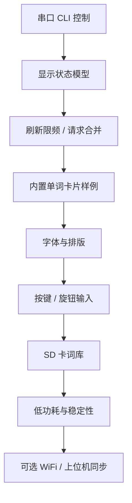
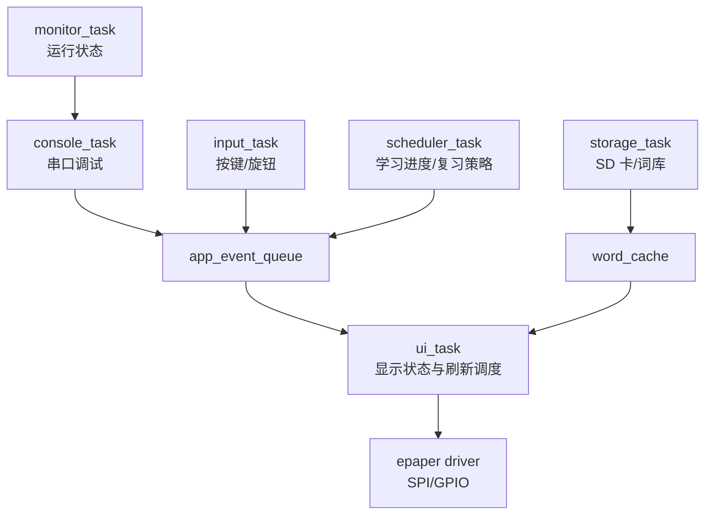
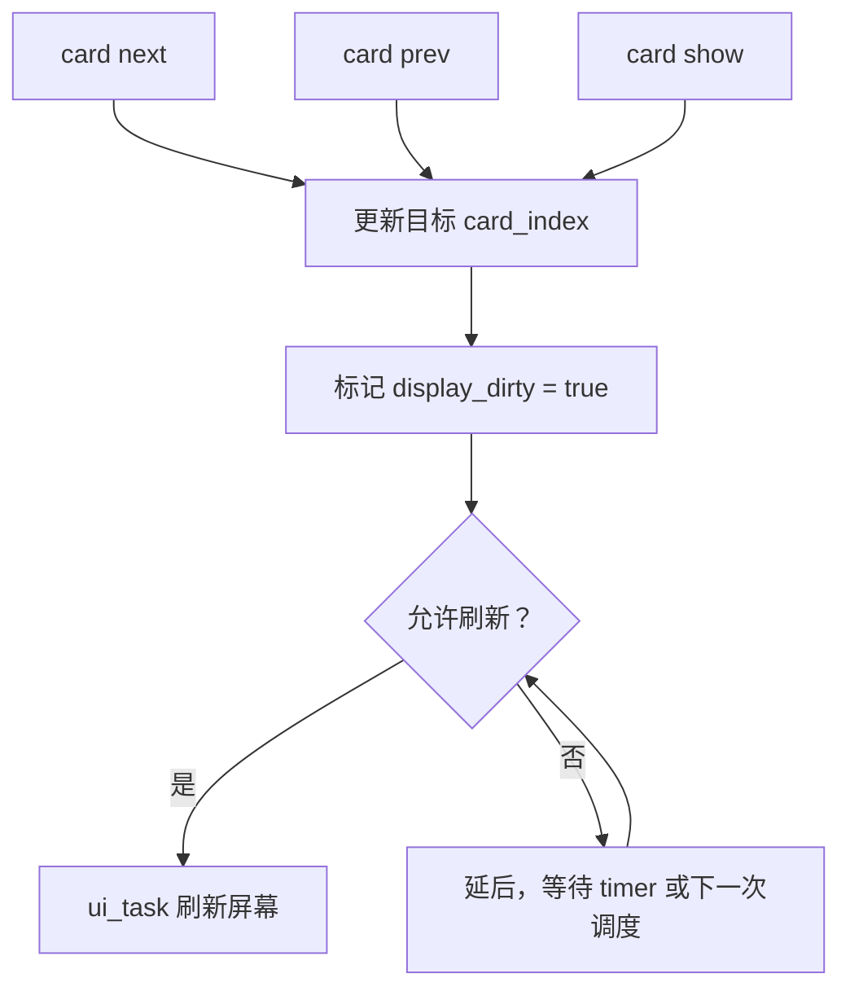

# 06. 墨水屏单词记忆卡片项目构想

日期：2026-06-07

状态：草案，后续随着实验和学习过程持续调整。

## 1. 项目方向

这个项目的最终成品方向暂定为：

```text
基于 RP2350-PiZero + FreeRTOS + 四色墨水屏的英语单词记忆卡片设备
```

它不是为了追求复杂功能堆叠，而是借助一个真实但规模可控的应用，系统学习嵌入式工程和 FreeRTOS 的核心特点。

墨水屏的限制反而很适合这个方向：

| 墨水屏特性 | 对应使用场景 |
| --- | --- |
| 刷新慢 | 背单词本来需要停留阅读 |
| 不适合高频动画 | 单词卡片以静态内容为主 |
| 物理尺寸有限 | 一屏只展示一个单词和重点信息 |
| 四色显示 | 用颜色表达信息层级 |
| 断电/休眠后画面可保持 | 适合低功耗学习设备 |

## 2. 初步显示内容

一张单词卡片可以包含：

```text
单词
音标 / 词性
核心释义
例句
重点标注
```

四色的初步分工：

| 颜色 | 可能用途 |
| --- | --- |
| 黑色 | 单词、普通正文、主要例句 |
| 白色 | 背景 |
| 红色 | 生僻但高频考察含义、易错点 |
| 黄色 | 重要搭配、词根词缀、构词法标注 |

这不是最终设计，只是第一版信息层级假设。实际效果需要结合屏幕可读性、刷新残影、字体大小再调整。

## 3. 工程学习主线

项目目标不是一次性做完整产品，而是按“一个阶段解决一个工程问题”的方式推进。



每个阶段都尽量对应一个 FreeRTOS 或嵌入式工程概念：

| 项目阶段 | 学习重点 |
| --- | --- |
| 串口控制墨水屏 | Task、Queue、外设服务任务 |
| 显示请求合并 | 状态模型、队列策略、事件压缩 |
| 刷新限频 | Tick、Software Timer、超时等待 |
| 按键 / 旋钮 | 中断、`FromISR` API、去抖 |
| SD 卡词库 | 文件系统、阻塞外设隔离、缓存 |
| 字库与排版 | 存储布局、渲染缓冲、内存约束 |
| WiFi / 上位机 | Stream Buffer、Message Buffer、协议设计 |
| 低功耗 | sleep、任务挂起、tickless idle、唤醒源 |
| 稳定性 | watchdog、assert、hook、栈/堆监控 |

## 4. 软件结构设想

未来可以逐渐演化成这样的任务结构：



当前已经具备的基础：

1. `console_task`：串口命令入口。
2. `display_queue`：显示请求队列。
3. `ui_task`：墨水屏独占任务。
4. `log_mutex`：保护多任务串口输出。
5. `monitor_task`：观察栈余量和队列状态。

下一步不急着增加外设，而是先把 `ui_task` 从“执行命令”升级成“维护显示状态”。

## 5. 显示刷新策略设想

墨水屏不适合“来一个请求刷一次”。更合理的策略是：

```text
用户连续切换单词
    -> 只记录最后想看的单词
    -> 如果刷新间隔太短，延后刷新
    -> 到达允许刷新时间后，只刷新最终状态
```

理想模型：



这会自然引出：

1. 请求合并。
2. 刷新限频。
3. UI 状态机。
4. 完成通知。
5. 忙碌状态反馈。

## 6. 数据来源设想

阶段一先不接 SD 卡，直接用内置样例数据：

```c
typedef struct {
    const char *word;
    const char *phonetic;
    const char *meaning;
    const char *example;
    const char *note;
} vocabulary_card_t;
```

这样可以先验证：

1. 屏幕排版是否舒服。
2. 英文字体大小是否合适。
3. 四色标注是否清晰。
4. 刷新策略是否可用。

后续再考虑：

| 数据来源 | 作用 |
| --- | --- |
| Flash 内置数组 | 最小可行 demo |
| SD 卡 CSV / JSON / 自定义格式 | 大词库 |
| 串口推送 | 调试和小批量更新 |
| WiFi 推送 | 每日单词、上位机同步 |

## 7. 息屏展示模式设想

除了背单词主功能，后续可以加入一个更有个人风格的“息屏展示”模式：

```text
学习模式结束 / 长时间无输入
    -> 进入低频刷新展示页
    -> 显示插画、动漫 / 游戏作品经典语录、每日主题内容
```

这部分不作为早期目标，但可以作为最终设备的趣味扩展。它和墨水屏也比较契合：内容停留时间长、画面偏静态、可以低频刷新。

可能内容来源：

| 内容 | 说明 |
| --- | --- |
| 本地收藏插画 | 最稳妥，先从 SD 卡或 Flash 缓存读取 |
| Pixiv 等站点每日推荐 | 需要后续确认 API、登录、授权、缓存和使用条款 |
| 动漫 / 游戏经典语录 | 可以先做本地精选文本库 |
| 每日单词 + 插画背景 | 把学习功能和展示功能结合 |

工程上会自然引出一些新问题：

1. 图片缩放、裁剪、抖动和四色量化。
2. 大图缓存和 SD 卡文件组织。
3. WiFi 拉取、失败重试、离线兜底。
4. 内容版权、来源授权和接口使用规则。
5. 低功耗状态下的唤醒与定时刷新。
6. 展示内容和学习内容之间的状态切换。

早期实现可以很克制：

```text
先不联网
先不接 Pixiv
先用本地内置语录或 SD 卡图片
先验证四色屏显示效果和刷新节奏
```

后续如果真的接入在线内容，再单独验证网站接口、使用条款和图片处理流程。这个功能可以作为项目的“nerd / geek 私心扩展”，但不让它抢走当前学习 FreeRTOS 主线的位置。

## 8. 暂不急着解决的问题

这些方向很有价值，但当前不需要一开始就展开：

1. 大词库文件格式。
2. 中文字体完整字库。
3. 局部刷新最终方案。
4. 外壳与结构设计。
5. WiFi 模块和上位机协议。
6. 复习算法，例如间隔重复。
7. 电池供电和功耗测试。

先把 RTOS 结构和显示模型做稳，再逐个引入这些问题。

## 9. 问题 / 待验证

### 9.1 已观察到的问题

目前已经观察到：

1. 四色墨水屏全局刷新时间较长。
2. 刷新过程中串口命令可以继续进入 `display_queue`，但屏幕变化要等 `ui_task` 处理。
3. 连续发送显示命令时，请求可能只是 `queued`，不代表已经刷新完成。
4. 屏幕刷新后自动 sleep，再发送 `screen sleep` 会提示 `panel already asleep`。

这些现象说明：显示层必须有明确的忙碌状态和刷新调度。

### 9.2 潜在可能问题

后续需要验证：

1. 这块四色屏是否支持实用的局部刷新。
2. 局部刷新是否会带来明显残影或颜色异常。
3. 中文字体占用的 Flash / RAM 是否可接受。
4. SD 卡读写是否会长时间阻塞任务。
5. 按键输入和屏幕刷新之间是否需要更清晰的事件优先级。
6. 频繁刷新是否影响屏幕寿命或显示质量。
7. 在线插画 / 语录来源是否有稳定、合规的获取方式。
8. 图片四色量化后是否仍然有足够观感。

### 9.3 参考依据定位

| 资料 | 位置 |
| --- | --- |
| Waveshare 2.15inch e-Paper HAT+ (G) manual | https://www.waveshare.com/wiki/2.15inch_e-Paper_HAT%2B_(G)_Manual |
| 刷新注意事项 | manual 页面 `Precautions` |
| SPI 通信方式 | manual 页面 `Communication Method` |
| 四色像素打包 | manual 页面 `Programming Principle` |
| 当前墨水屏驱动 | `epaper/epaper_2in15g.c` / `epaper/epaper_2in15g.h` |
| 当前 RTOS UI 入口 | `main.c` 中 `ui_task()` / `display_queue` |

## 10. 当前下一步

下一步建议只做一件事：

```text
把 display_queue 从“屏幕命令队列”
升级为“显示状态请求入口”
```

第一版目标可以很小：

1. 增加一个内置单词卡片样例。
2. CLI 支持 `card show` / `card next` / `card prev`。
3. `ui_task` 维护当前卡片索引。
4. 暂时仍然使用全局刷新。
5. 暂不接 SD、按键、WiFi。

这样我们可以继续沿着 FreeRTOS 主线学习，同时让项目逐渐长成一个真实作品。
