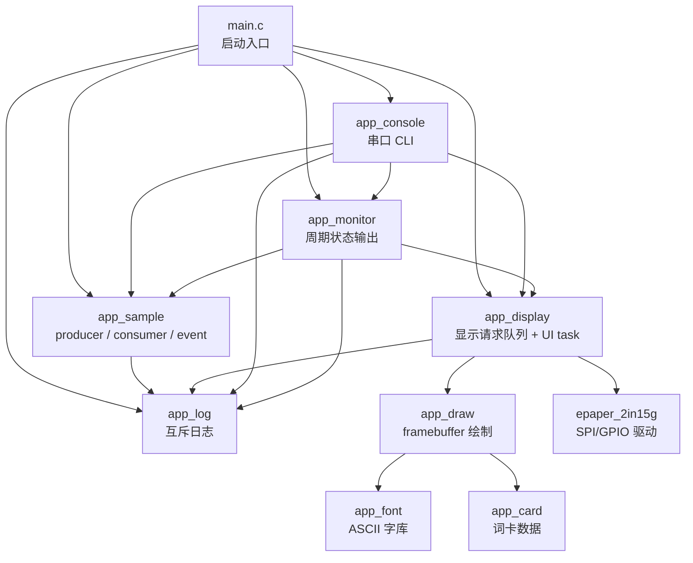

# 07. RTOS 工程模块化整理

日期：2026-06-07

分支：`feature/rtos-epaper-ui`

硬件：Waveshare RP2350-PiZero + Waveshare 2.15inch e-Paper HAT+ (G)

## 1. 本阶段目标

本阶段没有引入新的硬件功能，核心目标是把已经跑通的 RTOS demo 从“单文件堆功能”整理成可继续扩展的工程结构。

整理前，`main.c` 同时承担：

1. 系统启动。
2. 日志互斥保护。
3. producer / consumer / event 教学任务。
4. 串口 CLI 命令解析。
5. monitor 运行状态输出。
6. 墨水屏显示任务和显示请求队列。

这在早期 demo 阶段可以接受，但继续加入词卡 UI、SD 卡、按键输入、刷新调度后，会导致 `main.c` 失去边界。模块化之后，`main.c` 只保留启动骨架。

## 2. 当前模块结构



当前源文件加入构建的位置：

| 模块 | 职责 | 项目位置 |
| --- | --- | --- |
| `main.c` | 初始化、创建启动任务、启动调度器、FreeRTOS hook | `main.c:39` / `main.c:64` / `main.c:75` |
| `app_log.c/h` | mutex 保护的日志输出 | `app_log.c:11` / `app_log.c:18` |
| `app_sample.c/h` | producer / consumer / event 示例任务 | `app_sample.c:116` |
| `app_display.c/h` | 显示请求队列、UI task、墨水屏刷新入口 | `app_display.c:124` / `app_display.c:133` |
| `app_console.c/h` | 串口命令解析和命令分发 | `app_console.c:202` |
| `app_monitor.c/h` | 周期输出栈余量、队列状态 | `app_monitor.c:49` |
| `CMakeLists.txt` | 新模块加入可执行文件 | `CMakeLists.txt:40` |

## 3. `main.c` 现在负责什么

当前 `main.c` 的职责被收敛为：

```text
main()
    -> app_init()
    -> create startup_task
    -> vTaskStartScheduler()

startup_task
    -> wait_for_serial_monitor()
    -> app_log_init()
    -> app_sample_start()
    -> app_display_init()
    -> app_display_start()
    -> app_console_start()
    -> app_monitor_start()
    -> app_display_request_test_pattern()
    -> vTaskDelete(NULL)
```

关键位置：

| 内容 | 位置 |
| --- | --- |
| 等待 USB 串口监视器 | `main.c:30` |
| 初始化日志模块 | `main.c:48` |
| 启动 sample 任务组 | `main.c:51` |
| 初始化并启动显示模块 | `main.c:55` / `main.c:56` |
| 启动 CLI 和 monitor | `main.c:58` / `main.c:59` |
| 上电默认显示测试图案 | `main.c:61` |
| 启动 FreeRTOS 调度器 | `main.c:75` |
| malloc failed hook | `main.c:82` |
| stack overflow hook | `main.c:90` |

这个结构的好处是：后续添加新外设时，优先新增模块和 `xxx_start()`，而不是继续把逻辑塞回 `main.c`。

## 4. RTOS 机制在当前工程里的位置

| RTOS 概念 | 当前用途 | 项目位置 | FreeRTOS 依据 |
| --- | --- | --- | --- |
| Task | 每类长期运行逻辑一个任务 | `app_sample.c:31` / `app_display.c:41` / `app_console.c:27` / `app_monitor.c:19` | `lib/FreeRTOS-Kernel/include/task.h:385` |
| Queue | producer 到 consumer 的消息通道 | `app_sample.c:47` / `app_sample.c:70` | `lib/FreeRTOS-Kernel/include/queue.h:513` / `lib/FreeRTOS-Kernel/include/queue.h:913` |
| Queue overwrite | 显示请求只保留最新状态 | `app_display.c:68` / `app_display.c:164` | `lib/FreeRTOS-Kernel/include/queue.h:519` / `lib/FreeRTOS-Kernel/include/queue.h:597` |
| Mutex | 防止多任务串口输出交错 | `app_log.c:11` / `app_log.c:18` | `FreeRTOSConfig.h:20` |
| Task Notification | consumer 轻量通知 event task | `app_sample.c:82` / `app_sample.c:100` | `lib/FreeRTOS-Kernel/include/task.h:2987` / `lib/FreeRTOS-Kernel/include/task.h:3180` |
| Stack high watermark | 观察任务栈剩余量 | `app_sample.c:161` / `app_display.c:185` / `app_console.c:214` / `app_monitor.c:61` | `lib/FreeRTOS-Kernel/include/task.h:1832` |
| Hook | malloc 失败和栈溢出时停机 | `main.c:82` / `main.c:90` | `FreeRTOSConfig.h:39` / `FreeRTOSConfig.h:40` |

当前配置中已经打开但下一阶段还没正式使用的能力：

| 配置 | 位置 | 后续用途 |
| --- | --- | --- |
| `configUSE_EVENT_GROUPS` | `FreeRTOSConfig.h:23` | 多个系统状态位，例如 SD ready、display busy、input pending |
| `configUSE_TIMERS` | `FreeRTOSConfig.h:49` | 刷新限频、延迟刷新、空闲进入展示模式 |
| `configTOTAL_HEAP_SIZE` | `FreeRTOSConfig.h:36` | 动态创建任务、队列、timer 的堆来源 |

## 5. 模块边界说明

### 5.1 `app_log`

`app_log` 是所有任务共用的串口输出入口。它内部维护 mutex，外部模块只调用：

```c
app_log_init();
app_log_printf("...");
```

工程意义：

1. 串口输出属于共享资源。
2. 多个任务同时 `printf` 容易导致文本交错。
3. 把 mutex 封装在 `app_log`，其他模块不用关心锁细节。

### 5.2 `app_sample`

`app_sample` 保留当前教学用任务：

```text
producer_task
    -> xQueueSend(sample_queue)

consumer_task
    -> xQueueReceive(sample_queue)
    -> xTaskNotifyGive(event_task)

event_task
    -> ulTaskNotifyTake()
```

它现在的定位是“RTOS 学习样例模块”，不是产品功能模块。后续如果词卡项目成型，可以选择保留为调试 demo，也可以从主线移除。

### 5.3 `app_display`

`app_display` 负责墨水屏相关的高层控制：

1. 创建显示请求队列。
2. 创建 UI task。
3. 接收 `screen test`、`screen clear`、`screen sleep`、`card show` 等请求。
4. 调用 `app_draw` 准备 framebuffer。
5. 调用 `epaper_2in15g` 驱动执行刷新。

当前显示队列长度为 1，并使用 `xQueueOverwrite()`。这代表设计策略是：

```text
不排队保存所有显示请求
只保留最新目标显示状态
```

这符合墨水屏低频刷新特点。用户连续切换单词时，系统没有必要把每一次中间选择都刷出来。

### 5.4 `app_console`

`app_console` 负责把串口文本命令翻译成模块调用。

当前命令：

| 命令 | 作用 |
| --- | --- |
| `help` | 打印命令列表 |
| `stats` | 打印队列和栈余量 |
| `diag on/off` | 开关 sample / monitor 详细日志 |
| `screen test/clear/sleep` | 控制墨水屏测试、清屏、休眠 |
| `card show/next/prev` | 显示、切换词卡 |

注意：`app_console` 不直接刷屏，只向 `app_display` 发请求。这是当前结构里最重要的边界之一。

### 5.5 `app_monitor`

`app_monitor` 只在 `diag on` 时周期输出：

1. 当前 tick。
2. 各任务 stack high watermark。
3. sample queue 状态。
4. display queue 状态。

它的价值是运行时观察，而不是业务逻辑。后续如果加入 SD、按键、刷新调度，也可以继续把状态观测集中放在这里。

## 6. 工程思想

这次整理的核心不是“为了拆文件而拆文件”，而是明确三类边界。

### 6.1 入口层和功能层分离

`main.c` 应该回答：

```text
系统如何启动？
哪些模块被启动？
调度器何时开始运行？
异常 hook 在哪里？
```

它不应该回答：

```text
串口命令如何解析？
墨水屏如何刷一帧？
producer 的消息结构是什么？
monitor 打印哪些字段？
```

这些问题已经被移到各自模块。

### 6.2 命令和执行分离

串口输入是一种命令来源。未来按键、旋钮、WiFi、SD 自动任务也可能成为命令来源。

当前设计中：

```text
app_console
    -> 产生显示请求
app_display
    -> 执行显示请求
```

这样后续加入按键时，不需要让按键任务理解墨水屏刷新细节，只需要调用相同的显示请求接口。

### 6.3 慢外设独占

墨水屏刷新慢，且依赖 SPI/GPIO 时序。当前让 `app_display` 独占屏幕操作，避免多个任务同时访问同一外设。

这是嵌入式 RTOS 项目里常见的结构：

```text
多个任务提出请求
一个外设服务任务串行执行
```

## 7. 报错 / 问题修复

### 7.1 已观察到的问题：`main.c` 责任过多

现象：

```text
main.c 行数快速增长
串口 CLI、显示任务、sample queue、monitor、日志锁混在一起
```

排查：

1. 查看 `main.c` 中的状态变量和任务函数。
2. 发现多个模块级资源被入口文件直接持有。
3. 后续若继续加入 SD、按键、词卡状态机，维护成本会继续上升。

修复：

1. `app_log` 接管日志互斥。
2. `app_sample` 接管教学任务组。
3. `app_display` 接管显示队列和 UI task。
4. `app_console` 接管串口命令。
5. `app_monitor` 接管周期状态输出。

经验：

早期 demo 可以单文件推进，但当功能边界稳定后，应及时把“任务、资源、接口”按职责拆开。

### 7.2 已观察到的问题：拆分后容易遗漏 CMake 源文件

现象：

本次没有最终触发编译错误，因为已将新文件加入 `CMakeLists.txt`。但这是模块拆分时最常见的实际问题。

容易出现的错误形态：

```text
undefined reference to app_xxx_start
```

根因：

头文件被 include 了，但对应 `.c` 文件没有加入 `add_executable()`。

当前修复位置：

```text
CMakeLists.txt:40
    app_console.c
    app_display.c
    app_log.c
    app_monitor.c
    app_sample.c
```

经验：

每次新增 `.c` 文件，都要同步检查 `CMakeLists.txt`。在 Pico SDK 工程里，头文件能被找到不代表源文件已参与链接。

### 7.3 已观察到的问题：Windows 下 LF/CRLF 提示

现象：

提交前检查时出现：

```text
LF will be replaced by CRLF the next time Git touches it
```

解释：

这是 Git 在 Windows 下的换行符提示，不是 C 代码错误，也不是 CMake 错误。本次 `git diff --check` 没有发现实际空白错误。

处理：

暂不修改全局换行策略，避免引入无关改动。后续如果项目需要统一换行，可以单独讨论 `.gitattributes`。

### 7.4 潜在可能问题：模块之间相互依赖过多

当前 `app_console` 需要调用 `app_display`、`app_sample`、`app_monitor` 的统计接口。现在规模还可控，但如果命令继续增加，`app_console.c` 可能再次变大。

后续可选方向：

1. 引入命令表。
2. 把词卡命令拆成 `app_vocab_cli`。
3. 把统计输出拆成统一 `app_stats`。

现阶段不建议提前拆，因为还没有足够复杂的命令集合。

### 7.5 潜在可能问题：教学 sample 任务和产品逻辑混在同一固件

`app_sample` 当前用于学习 queue 和 task notification。它不是单词卡项目的必要功能。

后续如果串口输出、堆占用、任务数量变得紧张，可以考虑：

1. 用编译选项控制是否启用 sample 任务。
2. 将 sample 任务改为实验分支内容。
3. 在产品主线中删除 sample 任务，只保留相关笔记。

当前阶段继续保留，因为它仍有教学和诊断价值。

## 8. 下一阶段建议

现在结构已经足够支撑继续学习，不需要继续做纯拆分。

建议下一章学习 `Event Groups`。理由：

1. `FreeRTOSConfig.h:23` 已经开启 `configUSE_EVENT_GROUPS`。
2. 词卡项目天然需要多个状态位。
3. 它能把“系统状态”从单个队列请求中独立出来。

可以设计一个很小的 demo：

```text
事件位：
    DISPLAY_READY
    CARD_DIRTY
    DIAG_ENABLED

console:
    card next
        -> 更新目标卡片
        -> set CARD_DIRTY

display task:
    等待 CARD_DIRTY 和 DISPLAY_READY
    刷新屏幕
    清除 CARD_DIRTY
```

这会自然连接到后续工程问题：

1. 屏幕忙碌状态如何表达。
2. 多个输入源如何共同触发刷新。
3. SD 卡加载完成前是否允许显示。
4. 空闲多久进入息屏展示。

## 9. 本阶段结论

当前项目已经从 FreeRTOS API demo 进入“可扩展嵌入式应用”的早期结构。

已经具备的基础：

1. 任务拆分。
2. 队列通信。
3. 任务通知。
4. 互斥保护日志。
5. 串口 CLI。
6. 运行状态监控。
7. 墨水屏服务任务。
8. 简单词卡显示。

下一步应继续围绕真实产品需求学习 RTOS，而不是单独堆 API。`Event Groups`、刷新调度、按键输入、SD 存储都可以自然接到当前结构上。
